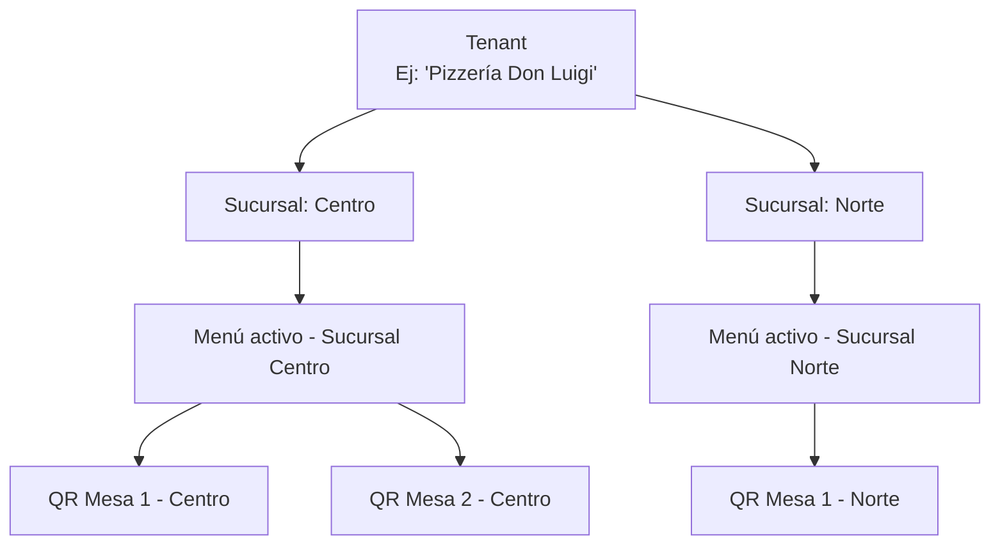
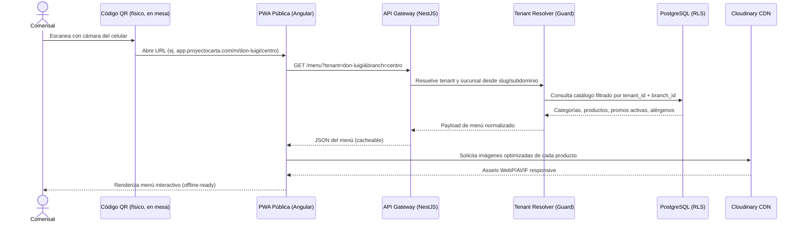

# Arquitectura del Sistema — Menú Digital PWA Multi-Tenant

> **Documento**: Especificación de Arquitectura
> **Proyecto**: ProyectoCarta — SaaS Multi-Tenant de Menú Digital PWA para Restaurantes
> **Estado**: Fase de Diseño (sin código de implementación)
> **Audiencia**: Equipo de Arquitectura, Tech Leads, futuros implementadores

---

## 1. Introducción y Alcance

`ProyectoCarta` es una plataforma SaaS Multi-Tenant que permite a cadenas de restaurantes y comercios gastronómicos independientes publicar su carta/menú en formato digital, accesible vía escaneo de código QR, con capacidades de Realidad Aumentada Web (WebAR) para visualizar platos, sistema de promociones dinámicas (Happy Hours), filtrado por alérgenos/dietas, soporte multi-idioma y un panel de administración para gestionar catálogos, sucursales y analítica de consumo.

Este documento define el **stack tecnológico**, el **patrón arquitectónico multi-tenant**, los **principios de rendimiento** y las **consideraciones de seguridad a nivel arquitectónico**. Las reglas de negocio detalladas de cada dominio se documentan en `domain-modules.md` y `features-spec.md`.

---

## 2. Stack Tecnológico

La siguiente tabla resume las decisiones tecnológicas principales y su justificación arquitectónica:

| Capa | Tecnología | Rol en el Sistema | Justificación |
|---|---|---|---|
| Frontend (PWA Comensal + Panel Admin) | **Angular 19** | Renderizado de la app pública del menú y del panel de administración de tenants | Standalone Components, Signals, ecosistema maduro para SPA/PWA empresariales, soporte oficial de Service Workers (`@angular/service-worker`) |
| Backend (API) | **NestJS** | Exposición de API REST/GraphQL, orquestación de lógica de negocio multi-tenant | Arquitectura modular basada en decoradores, inspirada en Angular (curva de aprendizaje compartida con el frontend), soporte nativo de Guards/Interceptors ideal para resolución de tenant |
| Base de Datos | **PostgreSQL** (vía **Supabase**) | Persistencia relacional de todo el dominio (tenants, catálogos, promos, analítica) | Motor relacional robusto, soporte de JSONB para atributos flexibles (variantes, traducciones), Row Level Security nativo para aislamiento multi-tenant |
| Plataforma de Datos | **Supabase** | Hosting de PostgreSQL, Storage de archivos, Auth opcional, canales Realtime | Reduce time-to-market al unificar DB + Storage + Auth + Realtime en una sola plataforma administrada, con RLS integrado a nivel de Postgres |
| ORM | **Prisma** | Capa de acceso a datos y gestión de esquema/migraciones | Type-safety end-to-end en el backend NestJS, migraciones declarativas versionadas, `Prisma Client` generado adaptado a un esquema multi-tenant con `tenant_id` |
| Estilos / Sistema de Diseño | **TailwindCSS** | Sistema de diseño utility-first para ambas superficies (PWA pública y panel admin) | Mobile-first por diseño, consistencia visual mediante tokens de diseño (design tokens), tamaño de bundle optimizado vía purga de clases no usadas |
| Procesamiento de Medios | **Cloudinary** | Pipeline de imágenes: compresión, transformación responsive, recorte de fondo con IA | Transformaciones on-the-fly vía URL, IA de background removal para generar assets aptos para WebAR, entrega automática de formatos modernos (WebP/AVIF) según el navegador |

### 2.1 Angular 19 — Frontend PWA + Panel Admin

**Por qué Angular 19 para este proyecto:**

- **Standalone Components**: elimina la necesidad de `NgModules` para la mayoría de las features, lo que favorece un **code-splitting** más granular por ruta (crítico para que la PWA del comensal cargue rápido en redes móviles tras escanear un QR).
- **Signals**: modelo de reactividad de grano fino que reduce el uso de `Zone.js` y mejora el rendimiento de detección de cambios en vistas con mucha interactividad (filtros de alérgenos instantáneos, contadores de combos, toggles de idioma).
- **Arquitectura dual de aplicación**: se contemplan dos "shells" Angular independientes (o un monorepo con proyectos separados):
  1. **App Pública (PWA del Comensal)**: optimizada para carga ultra-rápida, offline-first, sin autenticación.
  2. **Panel Admin (Backoffice)**: optimizada para productividad del dueño/staff del restaurante, con autenticación JWT y roles.
- **SSR/Hydration (evaluación futura)**: dado que el punto de entrada de la app pública es un QR (usuario anónimo, primera visita, sin caché previa), se recomienda evaluar **Angular SSR con Hydration no destructiva** para la ruta pública del menú, ya que reduce el *Time To First Byte* percibido y mejora el SEO de las páginas públicas de cada sucursal (relevante si se permite indexación del menú). El panel admin, al ser una herramienta interna autenticada, puede permanecer como SPA pura sin SSR.
- **Service Worker nativo**: Angular provee un paquete oficial de Service Worker que se integra directamente con la estrategia PWA descrita en la sección de Rendimiento.

### 2.2 NestJS — Backend API

**Por qué NestJS para un backend multi-tenant:**

- **Arquitectura modular**: NestJS organiza el backend en `Modules` que mapean naturalmente a los **Bounded Contexts** del dominio (Tenant, Catalog, Engagement, Media & AR, Analytics — ver `domain-modules.md`), favoreciendo bajo acoplamiento y alta cohesión.
- **Guards e Interceptors como mecanismo de resolución de Tenant**: NestJS permite implementar un `TenantResolutionGuard` (a nivel conceptual) que se ejecuta antes de cualquier controlador, resolviendo el tenant activo a partir de:
  - El subdominio de la request (`sucursal.miproyecto.app`), o
  - Un dominio personalizado (custom domain) del tenant, o
  - Un parámetro de ruta/slug (`/menu/:tenantSlug/:branchSlug`).
  Este tenant resuelto se inyecta en el contexto de ejecución de toda la petición, evitando fugas de datos entre tenants.
- **Inyección de dependencias jerárquica**: permite construir servicios "tenant-aware" que reciben el contexto de tenant de forma transversal, sin necesidad de pasarlo manualmente por cada capa.
- **Soporte de colas/tareas asíncronas**: procesos pesados como el recorte de fondo con IA (background removal) o la generación de reportes de analítica pueden desacoplarse en colas de trabajo (ej. patrón productor/consumidor) sin bloquear el hilo principal de la API.
- **Ecosistema alineado con Angular**: comparte filosofía de decoradores, inyección de dependencias y TypeScript estricto, lo que reduce la fricción cognitiva de un equipo full-stack.

### 2.3 PostgreSQL + Supabase — Datos, Storage y soporte de Auth/Realtime

| Componente | Rol específico |
|---|---|
| **PostgreSQL** | Motor relacional principal. Almacena entidades transaccionales (tenants, sucursales, catálogos, promos, alérgenos, analítica agregada). Se aprovechan tipos avanzados como `JSONB` para campos semi-estructurados (ej. traducciones i18n, metadatos de variantes) y **Row Level Security (RLS)** como capa adicional de aislamiento multi-tenant a nivel de motor de base de datos. |
| **Supabase Storage** | Almacenamiento de archivos binarios (imágenes originales antes de procesar, videos cortos de productos, assets AR ya procesados) con control de acceso por políticas, sirviendo como alternativa o complemento a Cloudinary para ciertos activos no transformables. |
| **Supabase Auth (opcional/evaluable)** | Puede utilizarse como proveedor de identidad para el panel admin (dueños/staff), delegando el manejo de contraseñas, verificación de email y flujos de recuperación, mientras NestJS conserva la lógica de autorización (RBAC) y emite/valida los JWT de sesión de aplicación. |
| **Supabase Realtime** | Canal opcional para features futuras que requieran actualización en vivo (ej. el panel admin ve en tiempo real que un producto se agotó, o el dashboard de analítica se actualiza sin refrescar). No es un requisito del MVP pero la plataforma lo deja disponible sin infraestructura adicional. |

**Justificación de la elección Supabase sobre self-hosting puro de Postgres**: unifica base de datos, storage y (opcionalmente) autenticación/tiempo real bajo una única plataforma administrada, reduciendo la carga operativa de un equipo pequeño, sin renunciar a la portabilidad de datos (es Postgres estándar por debajo).

### 2.4 Prisma — ORM y gestión de esquema multi-tenant

**Por qué Prisma:**

- **Type-safety end-to-end**: el cliente generado por Prisma refleja el esquema real de la base de datos, eliminando una clase entera de errores en tiempo de ejecución relacionados con nombres de columnas o tipos incorrectos.
- **Migraciones declarativas**: el esquema se define de forma declarativa y las migraciones se versionan, lo cual es crítico en un sistema multi-tenant donde cambios de esquema deben aplicarse de forma consistente a todos los tenants (en el modelo shared-schema).
- **Modelado natural de la relación tenant_id**: Prisma permite modelar conceptualmente que casi todas las entidades del dominio (sucursales, categorías, productos, promos) cuelgan de un `Tenant` raíz mediante una clave foránea `tenant_id`, y se pueden definir índices compuestos que incluyan siempre el `tenant_id` como primer componente, optimizando las consultas filtradas por tenant.
- **Middleware/extensiones de cliente**: permite interceptar cada consulta para inyectar automáticamente el filtro de `tenant_id` correspondiente al contexto de la petición actual, actuando como una segunda capa de seguridad complementaria a RLS de Postgres (defensa en profundidad).

### 2.5 TailwindCSS — Sistema de diseño Utility-First

- **Mobile-first por defecto**: los breakpoints de Tailwind están diseñados para que el estilo base sea el de pantallas pequeñas, alineándose directamente con el hecho de que el 100% del tráfico del comensal proviene de un dispositivo móvil (escaneo de QR).
- **Design Tokens centralizados**: colores de marca por tenant (theming), tipografías y espaciados se configuran como tokens reutilizables, lo que facilita ofrecer **personalización visual por tenant** (ej. color primario de marca) sin duplicar hojas de estilo.
- **Purga automática de CSS no utilizado**: mantiene el bundle de estilos mínimo, un requisito de rendimiento clave para la carga inicial del menú en redes móviles potencialmente lentas.
- **Consistencia entre PWA pública y Panel Admin**: al compartir el mismo sistema de utilidades, ambos frontends (comensal y backoffice) mantienen coherencia visual y velocidad de desarrollo.

### 2.6 Cloudinary — Procesamiento de Imágenes con IA

- **Compresión y entrega adaptativa**: Cloudinary detecta el navegador/dispositivo solicitante y entrega automáticamente el formato más eficiente soportado (WebP, AVIF), reduciendo el peso de las imágenes de productos sin intervención manual.
- **Recorte de fondo con IA (Background Removal)**: pieza clave para el módulo de **Media & AR** — permite generar automáticamente una versión del asset de producto con fondo transparente (PNG/WebP con canal alfa), requisito indispensable para que el modelo/imagen pueda "posarse" de forma creíble sobre una mesa real en el flujo de WebAR.
- **Transformaciones on-the-fly vía URL**: permite solicitar distintas resoluciones/recortes de la misma imagen origen sin necesidad de pre-generar y almacenar múltiples copias, lo cual simplifica el pipeline de Media descrito en `domain-modules.md`.
- **CDN integrado**: cada asset se sirve desde una red de distribución global, reduciendo la latencia percibida por el comensal sin importar su ubicación geográfica.

---

## 3. Patrón de Arquitectura SaaS Multi-Tenant

### 3.1 Jerarquía del Dominio

El sistema se organiza en una jerarquía estricta de 4 niveles, donde cada nivel inferior pertenece exactamente a un único elemento del nivel superior:

```
Tenant (Cliente SaaS / Cadena o Restaurante)
   └── Sucursal / Branch (Location física o virtual)
          └── Menú (Catálogo activo de esa sucursal)
                 └── QR (Punto de acceso físico/digital al Menú)
```

**Diagrama conceptual de la jerarquía:**



**Notas sobre la jerarquía:**

- Un **Tenant** representa la cuenta SaaS contratante (puede ser un restaurante único o una cadena con múltiples locales).
- Una **Sucursal (Branch)** representa un local físico, con su propia dirección, horario de atención y, potencialmente, su propio subconjunto de catálogo (una sucursal puede desactivar productos que no ofrece).
- El **Menú** no es una entidad completamente independiente sino la *proyección visible* del catálogo del Tenant filtrado/adaptado a una Sucursal concreta en un momento dado (considerando disponibilidad, promos activas y horarios).
- El **QR** es simplemente un puntero estable (URL corta o código codificado) hacia `tenant/sucursal`, lo que permite regenerar visualmente el QR sin invalidar los códigos ya impresos, siempre que el identificador de sucursal no cambie.

### 3.2 Flujo de Resolución: Escaneo de QR → Carga del Menú



Este flujo es intencionalmente **sin fricción y sin autenticación**: el comensal jamás debe iniciar sesión ni completar formularios para ver un menú. Toda la complejidad de resolución de tenant ocurre de forma transparente en el backend a partir de la URL escaneada.

### 3.3 Estrategia de Aislamiento de Datos Multi-Tenant

Existen tres estrategias clásicas de aislamiento de datos en un SaaS multi-tenant. Se documentan sus trade-offs antes de justificar la elección recomendada:

| Estrategia | Descripción | Ventajas | Desventajas |
|---|---|---|---|
| **Database-per-tenant** | Cada tenant tiene su propia base de datos física completa | Aislamiento máximo, fácil de exportar/eliminar un tenant completo | Alto costo operativo (backups, migraciones, monitoreo por cada BD), no escala a miles de tenants pequeños, complejo de administrar en Supabase (un proyecto por tenant es poco práctico) |
| **Schema-per-tenant** | Una sola base de datos física, pero cada tenant tiene su propio *schema* de Postgres | Buen aislamiento lógico, migraciones algo más manejables que database-per-tenant | La cantidad de schemas crece linealmente con los tenants (miles de restaurantes → miles de schemas), Prisma no soporta nativamente "schema dinámico por request" sin *workarounds* significativos, complica el pooling de conexiones |
| **Shared Schema (Shared Database, Row-Level)** | Una sola base de datos y un solo schema; todas las tablas relevantes incluyen una columna `tenant_id`, y cada fila pertenece a un tenant | Máxima eficiencia de recursos, migraciones se aplican una sola vez para todos los tenants, escala naturalmente a miles/decenas de miles de tenants pequeños (caso tipo restaurante), se integra perfectamente con Row Level Security de PostgreSQL | Requiere disciplina estricta: *toda* consulta debe filtrar por `tenant_id` (mitigado con RLS + middleware de Prisma), un bug de aislamiento es más costoso en términos de exposición de datos si no se implementan controles adecuados |

**Estrategia recomendada: Shared Schema con Row-Level Security (RLS) + filtrado obligatorio por `tenant_id`.**

Justificación:

1. **Perfil de tenant esperado**: el negocio objetivo son restaurantes individuales o pequeñas cadenas — se espera un volumen alto de tenants (potencialmente miles) con volumen de datos moderado por tenant (un catálogo de menú no es "big data"). Este perfil favorece fuertemente shared-schema, donde el costo marginal de agregar un tenant es casi nulo.
2. **Simplicidad operativa**: una sola base de datos significa un solo pipeline de backups, un solo lugar donde aplicar migraciones de Prisma, y un solo punto de monitoreo de performance.
3. **Defensa en profundidad**: se combinan **dos capas independientes** de aislamiento:
   - **Capa de aplicación**: un middleware/extensión de Prisma inyecta automáticamente `WHERE tenant_id = :currentTenant` en toda consulta ejecutada dentro del contexto de una request, gobernado por el `TenantResolutionGuard` de NestJS.
   - **Capa de base de datos (RLS de PostgreSQL)**: políticas de seguridad a nivel de fila que rechazan cualquier lectura/escritura cuya `tenant_id` no coincida con el tenant autenticado en la sesión de base de datos actual, actuando como red de seguridad incluso si existiera un bug en la capa de aplicación.
4. **Camino de escape para tenants "Enterprise"**: si en el futuro un tenant de gran volumen (una cadena masiva) requiere aislamiento físico dedicado por motivos contractuales o de compliance, la arquitectura no lo impide: es posible migrar selectivamente ese tenant a una base de datos dedicada sin rediseñar el resto de la plataforma, dado que el modelo de datos ya trata a `tenant_id` como frontera lógica explícita.

### 3.4 Resolución de Tenant en Runtime

La resolución del tenant activo para cada request pública puede realizarse mediante alguna de las siguientes estrategias (a definir en la fase de implementación, no excluyentes entre sí):

- **Slug en la ruta**: `app.proyectocarta.com/m/{tenantSlug}/{branchSlug}` — más simple de operar, no requiere configuración de DNS por tenant.
- **Subdominio por tenant**: `{tenantSlug}.proyectocarta.com` — mejor percepción de marca propia para el restaurante.
- **Dominio personalizado (Custom Domain)**: `carta.donluigi.com` — reservado como feature de planes superiores (ver `domain-modules.md`, dominio Tenant → Plans).

En todos los casos, el resultado de la resolución es un **Contexto de Tenant** (identificador de tenant + identificador de sucursal) que se propaga a lo largo de todo el ciclo de vida de la request.

---

## 4. Principios de Rendimiento

El rendimiento no es una preocupación secundaria sino un **requisito de producto de primer orden**: el comensal escanea un QR generalmente con conectividad Wi-Fi o datos móviles inestable dentro del propio restaurante, y abandonará el intento si el menú no carga en pocos segundos.

### 4.1 Mobile-First

- Todas las decisiones de UI/UX y de presupuesto de rendimiento ("performance budget") se diseñan primero para la resolución y capacidad de cómputo de un smartphone de gama media, no para desktop.
- El Panel Admin, aunque usado principalmente en tablet/desktop por el staff, también debe ser operable desde un celular para tareas rápidas (ej. marcar un producto como "agotado" desde el piso del restaurante).
- Las imágenes, tipografías y layouts se definen con breakpoints mobile-first de TailwindCSS, donde el estilo base sirve al viewport más pequeño y se amplía progresivamente.

### 4.2 PWA Offline-First con Service Workers

El menú digital debe seguir siendo consultable incluso con conectividad intermitente (un escenario común en sótanos, subsuelos de restaurantes o zonas con mala señal).

**Estrategias de caché recomendadas por tipo de recurso:**

| Tipo de Recurso | Estrategia de Cache | Justificación |
|---|---|---|
| Shell de la aplicación (JS, CSS, HTML del Angular build) | **Cache-First** | Estos assets cambian solo con cada despliegue; servirlos desde caché es instantáneo y seguro, con invalidación mediante hash de build |
| Imágenes de productos (vía Cloudinary) | **Cache-First con expiración larga** | Las imágenes de un producto cambian con poca frecuencia; se prioriza velocidad sobre frescura inmediata |
| Datos del menú (categorías, productos, precios, disponibilidad) | **Stale-While-Revalidate** | Se muestra inmediatamente la última versión cacheada del menú (percepción de velocidad instantánea) mientras en segundo plano se solicita la versión actualizada al servidor; si hay cambios, la UI se actualiza sin bloquear al usuario |
| Promos / Happy Hours activas | **Network-First con fallback a caché** | La vigencia de una promo es sensible al tiempo real; se prioriza obtener el estado más actual posible, pero si no hay red, se recurre a la última versión conocida para no dejar el menú en blanco |
| Analítica (eventos de escaneo, clicks) | **Background Sync / Cola de reintento** | Los eventos generados sin conexión se encolan localmente y se reenvían automáticamente al recuperar la conectividad, evitando pérdida de datos de analítica |

**Contenido mínimo que debe estar disponible offline para que el menú "funcione":**

- El *shell* completo de la aplicación (assets estáticos de Angular).
- La última versión conocida del catálogo de la sucursal actual (categorías, productos, precios, variantes, tags de alérgenos).
- Las imágenes ya visualizadas previamente por ese dispositivo (progresivamente, no de forma preventiva masiva, para no consumir datos móviles del usuario innecesariamente).
- Un estado de "modo offline" visible en la interfaz que informe al comensal que está viendo datos posiblemente no actualizados en tiempo real (ej. una promo podría haber vencido).

### 4.3 Compresión Agresiva de Imágenes

- **Formatos modernos**: se prioriza la entrega en **WebP/AVIF** sobre JPEG/PNG, negociado automáticamente por Cloudinary según el soporte del navegador solicitante.
- **Responsive Images**: cada imagen de producto se solicita en múltiples resoluciones (ej. thumbnail para grilla de categoría, resolución media para vista de detalle del producto, resolución alta únicamente si el comensal amplía la imagen), utilizando mecanismos nativos del navegador (`srcset`/`sizes` a nivel conceptual) para que el dispositivo elija la variante óptima.
- **Lazy Loading**: las imágenes fuera del viewport inicial (productos más abajo en la lista de categorías) se cargan de forma diferida, priorizando el ancho de banda para el contenido visible primero.
- **Integración con el pipeline de Media (`domain-modules.md`)**: toda imagen subida por el administrador pasa por un pipeline de compresión y normalización antes de estar disponible en el menú público, evitando que un archivo pesado subido sin optimizar impacte negativamente la experiencia de todos los comensales de ese tenant.

### 4.4 Consideraciones de Escalabilidad

- **CDN para assets estáticos y multimedia**: tanto el build de Angular como las imágenes de Cloudinary se distribuyen vía CDN, minimizando la latencia sin importar la ubicación geográfica del comensal o del restaurante.
- **Caching de queries multi-tenant**: dado que el catálogo de una sucursal cambia con baja frecuencia relativa (comparado con la frecuencia de lectura, que es altísima cada vez que alguien escanea un QR), se recomienda una capa de caché (ej. caché en memoria/Redis a nivel conceptual, o caché HTTP con invalidación por evento) para las respuestas de "menú completo de sucursal X", invalidada activamente cuando el administrador publica cambios en su catálogo.
- **Límites por plan (Rate/Resource Limiting a nivel de negocio)**: cada Plan de suscripción (ver `domain-modules.md`, dominio Tenant) define límites de recursos (cantidad de sucursales, cantidad de productos, espacio de almacenamiento de medios) que actúan como mecanismo natural de control de costos de infraestructura a medida que la plataforma escala.
- **Aislamiento de "tenants ruidosos" (noisy neighbor)**: la combinación de RLS + índices por `tenant_id` + rate limiting por plan (ver sección 5 y `features-spec.md`) previene que un tenant con tráfico anómalo (ej. un ataque de scraping) degrade el servicio para el resto de los tenants que comparten la infraestructura.

---

## 5. Consideraciones de Seguridad Arquitectónica (Resumen de Alto Nivel)

Esta sección introduce los pilares de seguridad a nivel arquitectónico; el detalle de reglas y flujos se especifica en `features-spec.md`, sección "Seguridad y Rate Limiting".

- **Aislamiento de Tenants**: garantizado mediante la estrategia de Shared Schema + Row Level Security descrita en la sección 3.3, reforzada por el `TenantResolutionGuard` a nivel de NestJS. Ningún dato de un tenant debe ser accesible desde el contexto de otro tenant bajo ninguna circunstancia.
- **Autenticación diferenciada por superficie**:
  - La **PWA pública del comensal** opera sin autenticación (acceso anónimo de solo lectura).
  - El **Panel Admin** requiere autenticación mediante **JWT**, con claims que incluyen el tenant al que pertenece el usuario autenticado y su rol (RBAC).
- **Rate Limiting**: aplicado de forma diferenciada entre endpoints públicos (protección contra scraping masivo del menú) y endpoints administrativos, con límites adicionales escalados según el Plan de suscripción del tenant.
- **CORS y Multi-Tenancy en dominios**: dado que un tenant puede eventualmente operar bajo un dominio personalizado, la configuración de CORS y las políticas de cookies/headers deben contemplar una lista dinámica de orígenes permitidos por tenant, en lugar de un único dominio fijo.
- **Protección de integridad de Analítica**: los endpoints que registran eventos de escaneo/clicks deben incorporar mecanismos anti-fraude básicos (ej. deduplicación por sesión, límites de frecuencia) para que las métricas reportadas a los tenants sean confiables.

---

## 6. Resumen de Decisiones Arquitectónicas Clave

| Decisión | Elección | Alternativas descartadas |
|---|---|---|
| Aislamiento multi-tenant | Shared Schema + RLS + filtrado en capa de aplicación | Database-per-tenant, Schema-per-tenant |
| Resolución de tenant | Slug/Subdominio resuelto en Guard de NestJS | Autenticación obligatoria para ver el menú |
| Estrategia de caché offline | Stale-While-Revalidate para datos, Cache-First para assets | Network-Only (rompe la experiencia offline) |
| Procesamiento de imágenes | Cloudinary con IA de recorte de fondo | Procesamiento manual/interno de imágenes |
| ORM | Prisma con middleware de tenant | Query builder manual, ORM sin soporte de migraciones declarativas |

---

*Fin de `architecture.md`. Continuar con `domain-modules.md` para el detalle de los Bounded Contexts del dominio.*
