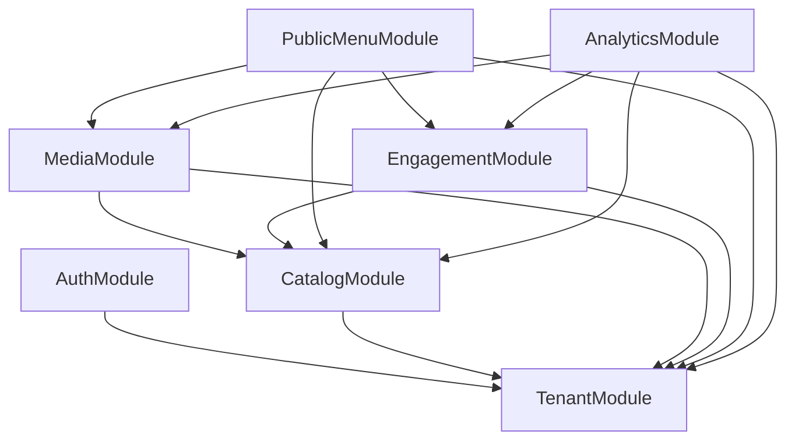
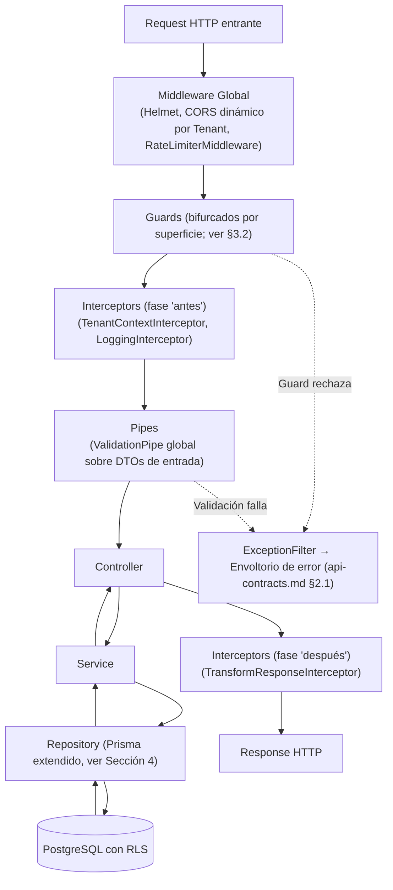
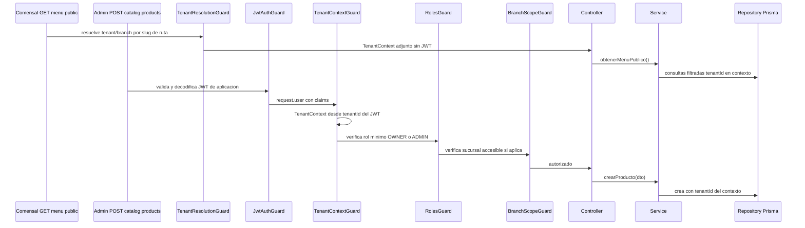
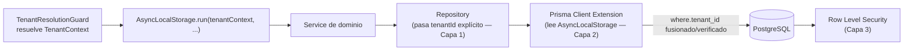

# Arquitectura Backend — NestJS (API Multi-Tenant)

> **Documento**: Especificación de Arquitectura Backend
> **Proyecto**: ProyectoCarta — SaaS Multi-Tenant de Menú Digital PWA para Restaurantes
> **Estado**: Fase de Diseño (diseño estructural, sin código de implementación)
> **Relacionado con**: `architecture.md`, `domain-modules.md`, `api-contracts.md`, `.cursor/rules/01-global-architecture.mdc`, `.cursor/rules/03-backend-nestjs.mdc`

---

## 1. Introducción y Alcance

Este documento diseña la **arquitectura interna del backend NestJS** que implementará los contratos de `api-contracts.md` respetando los 5 dominios definidos en `domain-modules.md`. Cubre tres aspectos:

1. **Estructura de Módulos**: mapeo de los dominios a `Module`s de NestJS y sus reglas de comunicación.
2. **Ciclo de vida de la Request**: el pipeline estricto Middleware → Guards → Interceptors → Pipes → Controller → Service → Repository, y el rol del `TenantResolutionGuard`.
3. **Aislamiento Multi-Tenant a nivel de datos**: el mecanismo de Prisma (Extensions/Middleware) que actúa como red de seguridad automática ante un eventual bug de un desarrollador.

No se define aquí ninguna clase, decorador ni firma de método concreta: solo la forma estructural (módulos, capas, pipeline) y los mecanismos conceptuales que la implementación deberá respetar.

---

## 2. Estructura de Módulos (Domain-Driven Design en NestJS)

### 2.1 Principio de Mapeo

Cada uno de los 5 **Bounded Contexts** de `domain-modules.md` se mapea a un `Module` de NestJS de primer nivel. Además, se agregan módulos de infraestructura transversal (no son un dominio de negocio en sí) y un módulo de **composición de lectura** para el menú público, que orquesta varios dominios sin que estos dependan entre sí de forma incorrecta.

| Dominio (`domain-modules.md`) | Módulo NestJS | Responsabilidad |
|---|---|---|
| Tenant | `TenantModule` | Tenants, Sucursales, Usuarios, Roles (RBAC), Planes y sus límites. Es el módulo raíz: ningún otro módulo de dominio puede ser importado por él. |
| — (transversal, datos de Tenant) | `AuthModule` | Única autoridad de identidad y sesión del Panel Admin: login, Argon2id, emisión/validación del JWT de aplicación, refresh opaco (cookie HttpOnly), logout/revocación. Depende de `TenantModule` para leer Usuarios/Roles. No delega identidad a Supabase Auth. |
| Catalog | `CatalogModule` | Categorías (jerarquía auto-referencial), Productos, Combos, Variantes. |
| Engagement | `EngagementModule` | Promos y Happy Hours, incluyendo el motor de evaluación de vigencia y resolución de solapamiento (`features-spec.md` §3.2). |
| Media & AR | `MediaModule` | `MediaAsset`, `ProcessedVariant`, integración con Cloudinary y Supabase Storage, orquestación del pipeline de compresión/recorte de fondo con IA. |
| Analytics | `AnalyticsModule` | `ScanEvent`, `InteractionEvent`, `AggregatedMetric`. Dominio de solo consumo/agregación (`domain-modules.md` §6.5). |
| — (composición de lectura) | `PublicMenuModule` | Orquesta `CatalogModule` + `EngagementModule` + `MediaModule` + `TenantModule` para construir el payload único de `GET /api/v1/menu/public/...` (`api-contracts.md` §3). No contiene entidades propias: es una capa de agregación de solo lectura. |
| — (infraestructura) | `PrismaModule` (global) | Expone el cliente Prisma extendido (ver §4) a todos los módulos. |
| — (infraestructura) | `CommonModule` (global) | Guards (`JwtAuthGuard`, `TenantContextGuard`, `RolesGuard`, `BranchScopeGuard`), Interceptors, Filters, decoradores compartidos (`@CurrentTenant()`, `@CurrentUser()`, `@RequiredRole()`, `@Public()`), configuración validada de variables de entorno. |

### 2.2 Grafo de Dependencias entre Módulos

Este grafo es **idéntico en dirección** al "Mapa de Dependencias Consolidado" de `domain-modules.md` §7: nunca un módulo "de nivel inferior" importa uno "de nivel superior". En particular:

- `TenantModule` **no importa a ningún otro módulo de dominio**: es la raíz.
- `CatalogModule` **no importa `EngagementModule` ni `MediaModule`**, aunque conceptualmente "sepa" que existen assets y promos asociadas a sus entidades — esa composición ocurre en `PublicMenuModule`, nunca dentro de `CatalogModule` mismo.
- `AnalyticsModule` es el único módulo de dominio que puede importar a **todos** los demás (solo para validar pertenencia de las entidades referenciadas por un evento, `features-spec.md` §7.5), pero **ningún módulo importa a `AnalyticsModule`**, preservando su carácter de dominio terminal.

### 2.3 Reglas de Comunicación entre Módulos

1. **Exportación explícita de Services**: un módulo solo expone a sus consumidores los `Service`s listados en su array `exports`; nunca se exportan Repositories directamente (mantiene la capa de Repository como un detalle de implementación interno del módulo dueño del dominio, ver `.cursor/rules/03-backend-nestjs.mdc`).
2. **Prohibición de dependencias circulares**: si dos módulos parecieran necesitar conocerse mutuamente, la señal correcta es que falta un tercer módulo de composición (como `PublicMenuModule`) o que la comunicación debe invertirse mediante eventos (punto siguiente), nunca resolverlo con `forwardRef()` como solución por defecto.
3. **Comunicación inversa vía eventos de dominio**: para los casos donde un módulo "de nivel inferior" necesita notificar algo a uno "de nivel superior" en el grafo (ej. `MediaModule` termina de procesar el recorte de fondo con IA y `CatalogModule` necesita reflejar que el asset AR de un Producto ya está listo), se usa un **Event Emitter interno** (`@nestjs/event-emitter` o equivalente): `MediaModule` emite un evento de dominio (ej. `media-asset.processed`) sin conocer quién lo escucha, y un listener dentro de `CatalogModule` se suscribe a ese evento. Así se evita que `MediaModule` tenga que importar `CatalogModule`, rompiendo lo que de otro modo sería una dependencia circular con `MediaModule → TenantModule/CatalogModule` ya existente en sentido contrario.
4. **`PublicMenuModule` es de solo lectura y no contiene lógica de escritura de negocio**: únicamente combina los resultados de los servicios de lectura de `CatalogModule`, `EngagementModule` y `MediaModule` (equivalente a un *read model* de composición) para armar el JSON del contrato público, sin duplicar reglas de negocio que ya viven en su módulo dueño (ej. la resolución de qué Promo aplica sigue viviendo en `EngagementModule`, `PublicMenuModule` solo la invoca).

---

## 3. Flujo de la Petición (Request Lifecycle)

### 3.1 Pipeline General de NestJS Aplicado a este Proyecto

### 3.2 Orden de Guards — Bifurcado por Superficie

Los guards de NestJS **no reentran**: no se puede ejecutar `TenantResolutionGuard`, luego `JwtAuthGuard`, y “volver” al primero para setear el contexto. Por eso el pipeline se **bifurca**. `ThrottlerGuard` es siempre el primero (rechaza abuso antes de resolver tenant o JWT).

**Público** (`/api/v1/menu/**`, analytics de comensal):

`ThrottlerGuard` → `TenantResolutionGuard` (slug de ruta) → Controller. Sin JWT. Sin `RolesGuard`.

**Admin no autenticado** (`POST /api/v1/admin/auth/login`, refresh, logout):

`ThrottlerGuard` (más estricto en login). Rutas marcadas `@Public()`. Sin JWT. Sin `TenantContext` de negocio.

**Admin autenticado, sin tenant** (`POST /api/v1/admin/auth/change-password`): JWT + `@SkipTenantContext()`. Opera sobre `sub`/`tenantId` del JWT, no sobre `X-Tenant-Id`.

**Admin autenticado** (`/api/v1/admin/**`):

| Orden | Guard | Rol |
|---|---|---|
| 1 | `ThrottlerGuard` | Rate limit administrativo (por plan del tenant cuando ya hay contexto; en login, por IP). |
| 2 | `JwtAuthGuard` | Valida firma y `exp` del JWT de aplicación, usuario `ACTIVE`. Puebla `request.user` con los claims (`api-contracts.md` §4.5). |
| 3 | `TenantContextGuard` | OWNER/ADMIN/STAFF: `TenantContext` = `tenantId` **de los claims**. `PLATFORM_ADMIN`: contexto nulo, o impersonación si envía `X-Tenant-Id` (cualquier otro rol que mande ese header: se ignora). Params/body no pueden cambiar el tenant. `X-Branch-Id` opcional: sucursal del selector del panel, validada contra ese tenant y el alcance del rol. |
| 4 | `RolesGuard` | Decorador `@RequiredRole(...)`. Compara el rol efectivo contra la jerarquía `PLATFORM_ADMIN > OWNER > ADMIN > STAFF`. |
| 5 | `BranchScopeGuard` | Solo handlers que declaran sucursal: el `branchId` de la operación debe estar en las asignaciones del usuario (o cubierto por un rol de alcance `TENANT`). |

Controllers administrativos: `@UseGuards(JwtAuthGuard, RolesGuard)` + `@RequiredRole(...)`. Está prohibido verificar roles con `if` sueltos en Services (`.cursor/rules/03-backend-nestjs.mdc`). Fail-closed: operación tenant-scoped sin `TenantContext` se rechaza.

### 3.3 Resolución de Tenant — Diseño Conceptual

Es el mecanismo más crítico de aislamiento, porque de él depende que el resto del pipeline (Interceptors, Services, Repositories, y la extensión de Prisma de la Sección 4) tenga un `TenantContext` confiable. Según la superficie, lo ejecuta `TenantResolutionGuard` (público) o `TenantContextGuard` (admin autenticado).

**Tres rutas de resolución, una misma forma de salida** (`TenantContext { tenantId, branchId | null }`; `tenantId` puede ser nulo solo en consola de plataforma):

| Origen de la request | Cómo se resuelve el `tenantId`/`branchId` |
|---|---|
| Ruta pública (`/api/v1/menu/public/:tenantSlug/:branchSlug`) | `TenantResolutionGuard` extrae slugs de la **ruta**, consulta (caché corta) a `TenantLookupService` de `TenantModule`, y valida que el Tenant no esté `SUSPENDED`/`CANCELLED` (`TRIAL` y `ACTIVE` resuelven) y que la Sucursal exista. |
| Ruta administrativa de usuario de tenant | `TenantContextGuard` **no** resuelve desde slugs: usa el `tenantId` de los claims (después de `JwtAuthGuard`). Un administrador de tenant nunca puede operar sobre otro Tenant aunque manipule la URL o el body. |
| Ruta administrativa de `PLATFORM_ADMIN` | Sin tenant de negocio (consola de tenants/planes: cliente Prisma **sin** extensión de tenant, vía auditada §4.2). Impersonación de soporte: header `X-Tenant-Id` **solo** si el caller es `PLATFORM_ADMIN`; ese valor se convierte en `TenantContext`. |

**Salida**: el contexto queda disponible de dos formas complementarias:

1. **Explícita**: adjuntado a `request` (ej. `request.tenantContext`), accesible vía `@CurrentTenant()` de `CommonModule`.
2. **Implícita (capa de datos)**: `AsyncLocalStorage` (Sección 4), para que Prisma lea el `tenantId` sin pasarlo a mano en cada llamada interna. Ausente en consola de plataforma (cliente Prisma sin extensión).

**Fallos de resolución**: Tenant/Sucursal inexistente o suspendido → `TENANT_OR_BRANCH_NOT_FOUND` / `TENANT_SUSPENDED` (`api-contracts.md` §3.7), cortando el pipeline.

### 3.4 Secuencia Comparada: Request Pública vs. Request Administrativa

---

## 4. Estrategia de Aislamiento Multi-Tenant a Nivel de Datos (Prisma)

### 4.1 Objetivo

Garantizar que **incluso si un desarrollador olvida filtrar por `tenant_id` en un Service o Repository**, el sistema no exponga ni modifique datos de otro Tenant. Esto se logra agregando una **capa automática a nivel del cliente Prisma**, complementaria (no sustituta) de la regla ya obligatoria en `.cursor/rules/03-backend-nestjs.mdc` de pasar `tenantId` explícitamente a cada método de Repository.

Esto amplía a **tres capas independientes de defensa en profundidad** (la Capa 1 y la Capa 3 ya están descritas en `architecture.md` §3.3; la Capa 2 es el foco de esta sección):

| Capa | Mecanismo | Qué cubre |
|---|---|---|
| 1 — Disciplina de código | `tenantId` explícito y obligatorio en cada método de Repository (`.cursor/rules/03-backend-nestjs.mdc`) | Es la capa "intencional": el desarrollador filtra a propósito. Falla si el desarrollador se olvida. |
| **2 — Prisma Client Extension automática** | Intercepta cada operación de Prisma e inyecta `tenant_id` aunque la Capa 1 haya fallado | Red de seguridad silenciosa a nivel de aplicación, descrita en esta sección. |
| 3 — Row Level Security de PostgreSQL | Políticas de base de datos que rechazan filas de otro `tenant_id` a nivel del motor | Última línea de defensa, incluso ante un bug en las Capas 1 y 2 o una query cruda no controlada. |

### 4.2 Mecanismo: `AsyncLocalStorage` + Prisma Client Extension

**Paso 1 — Propagación del contexto sin pasarlo manualmente por cada capa.**

Inmediatamente después de que `TenantResolutionGuard` resuelve el `TenantContext` (Sección 3.3), un componente temprano del pipeline (un Interceptor global, ejecutado justo después de los Guards) envuelve el resto de la ejecución de esa request dentro de un contexto de `AsyncLocalStorage` (API nativa de Node.js). Esto significa que, sin necesidad de inyectar ni pasar el `tenantId` explícitamente a través de cada llamada intermedia, **cualquier código que se ejecute de forma asíncrona "dentro" de esa request** (Controller → Service → Repository → Prisma) puede leer el `tenantId` activo consultando ese almacenamiento contextual.

**Paso 2 — Extensión de Prisma (`$extends`) con un componente de tipo `query`.**

Se define una extensión de Prisma Client que se aplica **solo sobre los modelos marcados como "tenant-scoped"** (la lista de entidades que en `domain-modules.md` cuelgan directa o indirectamente de un Tenant: `Branch`, `Category`, `Product`, `Combo`, `Variant`, `Promo`, `HappyHour`, `MediaAsset`, `ScanEvent`, `InteractionEvent`, etc. — explícitamente **no** se aplica sobre el propio modelo `Tenant`, ya que resolverlo por `slug` es la única operación legítima que debe poder ocurrir sin un `tenant_id` previo). Esta extensión intercepta cada operación antes de que llegue a la base de datos:

- Para operaciones de **lectura** (`findMany`, `findFirst`, `findUnique`, `count`, `aggregate`): fusiona automáticamente `tenant_id: <tenantId del contexto activo>` dentro de la cláusula `where` recibida, sin importar si el Service que originó la llamada ya lo incluyó o no (si ya estaba incluido, la fusión es idempotente).
- Para operaciones de **escritura** (`create`): si el `data` no incluye `tenant_id`, la extensión lo completa automáticamente con el valor del contexto activo, evitando registros "huérfanos" de tenant por un olvido.
- Para operaciones de **actualización/eliminación** (`update`, `updateMany`, `delete`, `deleteMany`): fusiona el filtro de `tenant_id` en el `where`, garantizando que ninguna mutación pueda alcanzar accidentalmente una fila de otro Tenant, incluso si el `id` provisto por error perteneciera a otro cliente.

**Paso 3 — Comportamiento ante ausencia de contexto (fail-closed, no fail-open).**

Si la extensión detecta que se está ejecutando una operación sobre un modelo "tenant-scoped" **sin** un `TenantContext` activo en el `AsyncLocalStorage` (ej. un job en background mal configurado, o un script de mantenimiento), la operación debe **rechazarse explícitamente** (lanzar una excepción interna) en lugar de ejecutarse sin filtro. Cualquier caso legítimo que necesite operar verdaderamente "a través de todos los tenants" (consola de `PLATFORM_ADMIN`, agregación de métricas de plataforma) debe usar una vía explícitamente distinta y auditada (un cliente Prisma separado **sin** esta extensión, reservado a procesos internos claramente identificados), nunca un "bypass" implícito o silencioso. La impersonación de soporte (`X-Tenant-Id` + `PLATFORM_ADMIN`) **sí** entra en `AsyncLocalStorage` con el tenant impersonado y usa el cliente extendido.

### 4.3 Diagrama Conceptual del Mecanismo

### 4.4 Por qué esto Cumple el Objetivo de Negocio

- **Un bug en un Service** (ej. un desarrollador nuevo que arma un `where` sin `tenant_id` al agregar un endpoint de reporte ad-hoc) **ya no puede filtrar datos entre tenants**, porque la Capa 2 corrige/verifica la consulta antes de que llegue a Postgres, y la Capa 3 la rechazaría de todas formas si algo llegara a fallar en las dos capas anteriores.
- **No reemplaza la disciplina de la Capa 1**: se mantiene la regla de `.cursor/rules/03-backend-nestjs.mdc` de pasar `tenantId` explícito en los Repositories, porque la explicitud en el código sigue siendo la señal más clara para code review y tests; la extensión de Prisma es una **red de seguridad**, no una excusa para relajar esa disciplina.
- **Escalable a un futuro "tenant Enterprise" con base de datos dedicada** (`architecture.md` §3.3, punto 4): si ese caso se materializa, basta con que el `TenantContext` resuelto en el Guard seleccione qué instancia de cliente Prisma extendido usar (misma extensión, distinta conexión), sin rediseñar el mecanismo de aislamiento en sí.

---

## 5. Resumen de Decisiones de esta Fase

| Decisión | Elección |
|---|---|
| Mapeo dominio → módulo | 1 a 1 (`Tenant`, `Catalog`, `Engagement`, `Media`, `Analytics`) + `AuthModule`, `PublicMenuModule`, `PrismaModule`, `CommonModule` como módulos de infraestructura/composición |
| Comunicación entre módulos | Services exportados explícitamente + Event Emitter para notificaciones en sentido inverso; sin `forwardRef()` como solución de dependencias circulares |
| Orden de Guards | Bifurcado: público = Throttler → TenantResolution (slug); admin login = Throttler + `@Public()`; admin autenticado = Throttler → JwtAuthGuard → TenantContextGuard → RolesGuard → BranchScopeGuard |
| Resolución de tenant | Por slug de ruta (público) o por claims de JWT (admin de tenant). `PLATFORM_ADMIN`: sin tenant, o `X-Tenant-Id` solo para impersonación |
| Aislamiento de datos | 3 capas: `tenantId` explícito en Repository, Prisma Client Extension automática vía `AsyncLocalStorage`, Row Level Security de PostgreSQL. Consola de plataforma: cliente Prisma sin extensión |
| Comportamiento ante contexto ausente | *Fail-closed*: se rechaza la operación, nunca se ejecuta sin filtro por omisión |

---

*Fin de `backend-architecture.md`. Este documento se apoya en `domain-modules.md` para los dominios, en `api-contracts.md` para las formas de datos expuestas, y en `.cursor/rules/03-backend-nestjs.mdc` para las restricciones tecnológicas obligatorias del stack NestJS.*
