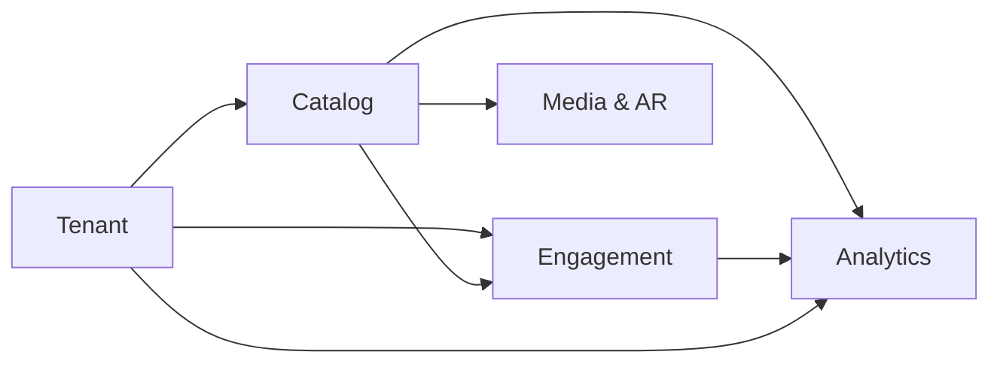
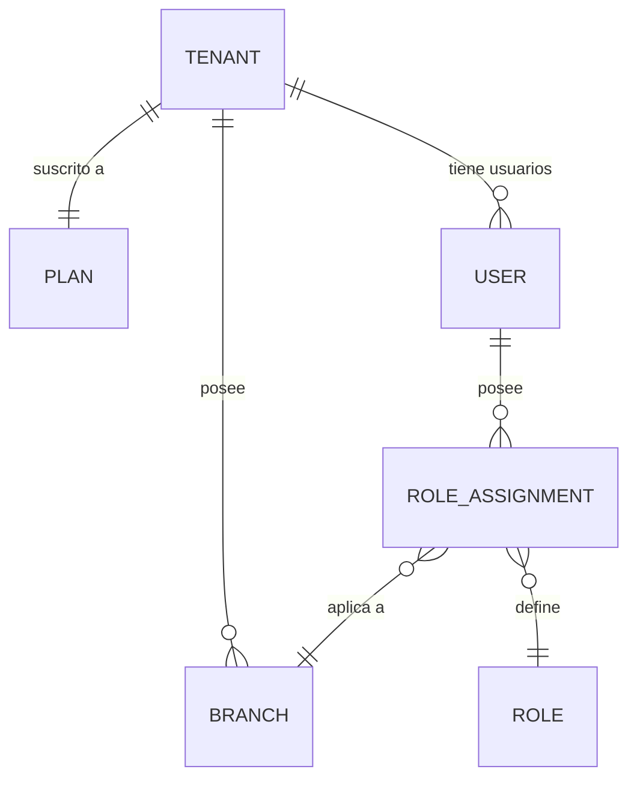
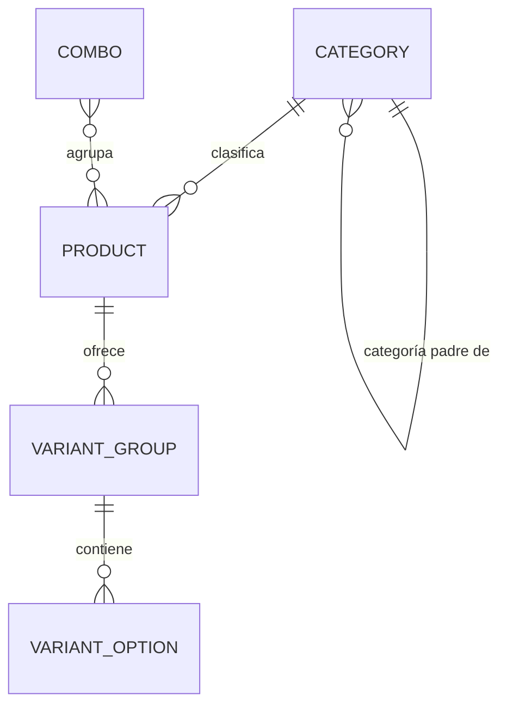
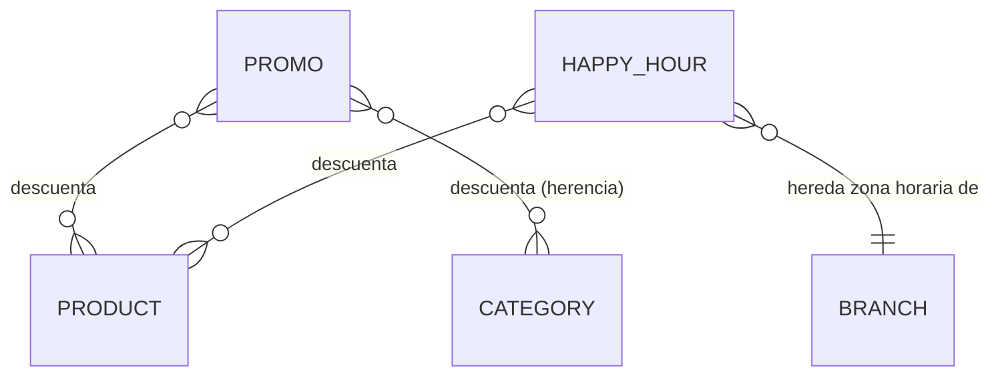
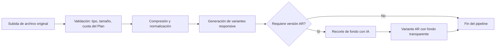
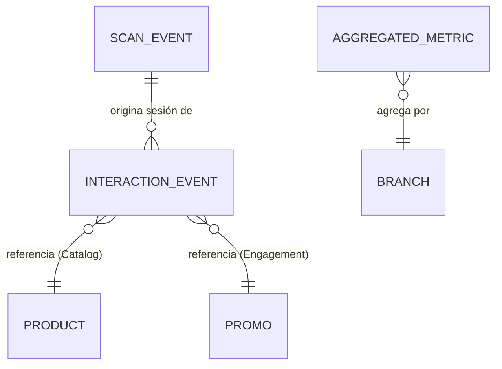

# Dominios y Módulos del Sistema (Bounded Contexts)

> **Documento**: Especificación de Dominios
> **Proyecto**: ProyectoCarta — SaaS Multi-Tenant de Menú Digital PWA para Restaurantes
> **Estado**: Fase de Diseño (sin código de implementación)
> **Relacionado con**: `architecture.md`, `features-spec.md`

---

## 1. Introducción

Este documento descompone el sistema en **5 dominios (Bounded Contexts)** siguiendo un enfoque orientado al dominio (Domain-Driven Design a nivel conceptual). Cada dominio se documenta con:

- **Propósito**: qué problema de negocio resuelve.
- **Entidades principales**: con sus atributos clave conceptuales (sin sintaxis SQL/Prisma).
- **Relaciones entre entidades**: cómo se conectan entre sí dentro del dominio.
- **Reglas e invariantes de negocio**: restricciones que el sistema debe garantizar siempre.
- **Dependencias con otros dominios**: acoplamientos intencionales y su dirección.

Los 5 dominios son:

1. **Tenant** — Identidad organizacional, sucursales, roles y planes.
2. **Catalog** — Categorías, productos, combos y variantes.
3. **Engagement** — Promos y Happy Hours.
4. **Media & AR** — Gestión de assets multimedia y su preparación para Realidad Aumentada.
5. **Analytics** — Métricas de interacción y consumo del menú.

---

## 2. Dominio: Tenant

### 2.1 Propósito

El dominio **Tenant** es la raíz organizacional de todo el sistema. Modela **quién** usa la plataforma (dueños del restaurante y su personal), **dónde** operan físicamente (sucursales) y **qué nivel de servicio** contrataron (plan de suscripción). Todo dato del sistema, directa o indirectamente, pertenece a un Tenant.

### 2.2 Entidades Principales

#### Tenant

Representa la cuenta contratante de la plataforma (puede ser un restaurante único o una cadena).

- **Identificador único** del tenant.
- **Nombre comercial** (razón social / nombre de marca visible).
- **Slug** (identificador legible usado en URLs públicas, único en toda la plataforma).
- **Dominio personalizado** (opcional, disponible según Plan).
- **Idioma por defecto** (usado como fallback cuando el comensal no selecciona idioma explícitamente).
- **Estado de la cuenta** (activo, suspendido, en período de prueba, cancelado).
- **Plan de suscripción actual** (referencia al Plan vigente).
- **Fecha de alta** y **fecha de próxima facturación/renovación**.
- **Configuración de marca** (color primario, logo — referencia a Media & AR).

#### Owner / User (Usuario del Panel Admin)

Representa a una persona con acceso al panel administrativo: o bien a **un** Tenant (dueño/staff), o bien a la **plataforma** (`PLATFORM_ADMIN`, sin tenant de negocio).

- **Identificador único** del usuario.
- **Nombre completo** y **correo electrónico** (usado como credencial de acceso; único a nivel plataforma).
- **Hash de contraseña** (Argon2id; nunca se expone). Ausente conceptualmente solo en invitaciones pendientes de aceptar.
- **Tenant de pertenencia** (opcional): obligatorio para `OWNER` / `ADMIN` / `STAFF`; **nulo** únicamente para `PLATFORM_ADMIN`.
- **Estado de la cuenta de usuario** (activo, invitado pendiente de aceptar, deshabilitado).
- **Idioma preferido de la interfaz de administración**.
- **Fecha de último acceso** (para auditoría básica).

#### Branch (Sucursal)

Representa un local físico o punto de venta del Tenant.

- **Identificador único** de la sucursal.
- **Nombre de la sucursal** (ej. "Centro", "Norte", "Sucursal Shopping X").
- **Slug de sucursal** (único dentro del Tenant, usado junto al slug del Tenant en la URL pública).
- **Dirección física** y **datos de contacto** (teléfono, WhatsApp, Instagram / redes sociales).
- **Imagen de portada** (banner 16:9, referencia a Media & AR), distinta del logo de marca del Tenant.
- **Horario de atención** (por día de la semana, con posibles múltiples franjas — ej. horario de almuerzo y cena).
- **Zona horaria** (relevante para el cálculo correcto de Happy Hours, ver dominio Engagement).
- **Estado operativo** (abierta, cerrada temporalmente, en mantenimiento).
- **Idioma por defecto de la sucursal** (puede sobrescribir el del Tenant, útil en cadenas con locales en distintas regiones/países).

#### Role (Rol de acceso — RBAC)

Define el nivel de permisos de un Usuario. Jerarquía (un rol mínimo exigido admite los de rango superior): `PLATFORM_ADMIN > OWNER > ADMIN > STAFF`.

- **Platform Admin (`PLATFORM_ADMIN`)**: operador de la plataforma (nosotros). No pertenece a ningún Tenant. Puede listar/suspender tenants, gestionar planes, e **impersonar** un tenant de soporte (`X-Tenant-Id` explícito, solo si el caller es `PLATFORM_ADMIN`). No se modela como un Owner mágico ni con un “tenant plataforma” sintético.
- **Owner (`OWNER`)**: control total sobre **todo** el Tenant (alcance `TENANT`, `branchId` nulo), incluyendo facturación, gestión de usuarios y **todas** las sucursales. No se acota a una sola sucursal: ese recorte es `STAFF` (y `ADMIN` cuando se asigne con alcance `BRANCH`).
- **Admin (`ADMIN`)**: gestión completa del catálogo, promos, sucursales y analítica, sin acceso a facturación ni a la posibilidad de eliminar el Tenant. Puede ser de alcance `TENANT` o `BRANCH`.
- **Staff (`STAFF`)**: acceso operativo limitado (ej. marcar productos como agotados, ver analítica básica de su sucursal asignada), sin permisos para modificar precios o estructura del catálogo. Alcance `BRANCH`.
- **(Extensible)**: el modelo de roles debe permitir agregar roles adicionales a futuro (ej. "Editor de contenido") sin romper la estructura existente.

Un mismo Usuario de tenant puede tener un Rol distinto en cada Sucursal a la que tiene acceso (ej. Admin en la sucursal Centro, Staff en la sucursal Norte), o un rol global a nivel Tenant (Owner). El JWT lleva todas las asignaciones; el guard evalúa la más privilegiada que aplique al `branchId` activo.

Matriz mínima del MVP:

- Crear/editar productos, combos, promos: `OWNER` o `ADMIN` (y `PLATFORM_ADMIN` impersonando).
- Marcar agotado: también `STAFF` en su sucursal.
- Invitar usuarios / facturación / eliminar tenant: `OWNER` (y plataforma).
- Consola de tenants / planes: solo `PLATFORM_ADMIN`.

#### Plan (Plan de Suscripción)

Define el nivel de servicio contratado y sus límites de uso.

- **Nombre del plan** (ej. Free, Pro, Enterprise).
- **Precio y periodicidad de facturación**.
- **Límite de sucursales** permitidas.
- **Límite de productos** totales (o por sucursal, a definir en implementación).
- **Límite de almacenamiento de medios** (espacio total en MB/GB para imágenes/videos).
- **Disponibilidad de features premium**: dominio personalizado, WebAR, soporte i18n multi-idioma, analítica avanzada, cantidad de idiomas simultáneos soportados.
- **Límite de tasa de peticiones (rate limit)** aplicable a la API para ese tenant (ver `features-spec.md`).

### 2.3 Relaciones entre Entidades

- Un **Tenant** posee **una o muchas Sucursales** (mínimo una sucursal para operar).
- Un **Tenant** está suscrito a **exactamente un Plan** vigente en cada momento.
- Un **Tenant** tiene **uno o muchos Usuarios** con acceso administrativo (`OWNER` / `ADMIN` / `STAFF`). Los `PLATFORM_ADMIN` **no** cuelgan de un Tenant.
- Un **Usuario** de tenant puede tener **una asignación de Rol por Sucursal** (o un rol global a nivel Tenant, como el Owner). Un `PLATFORM_ADMIN` tiene una única asignación de alcance `PLATFORM`, sin `tenantId` ni `branchId`.

### 2.4 Reglas e Invariantes de Negocio

1. **Un Tenant no puede operar sin al menos una Sucursal activa**; la creación del Tenant durante el onboarding (consola `PLATFORM_ADMIN`: `POST /api/v1/admin/platform/tenants`) crea en **una sola transacción Prisma** el Tenant, el User `OWNER` (alcance `TENANT`, `branchId` nulo — administra todas las sucursales) y la Branch inicial (Casa Matriz). El hash de contraseña se calcula fuera de la transacción. Guía operativa (estados `TRIAL`/`ACTIVE`, slugs, un dueño vs. varios locales vs. varias marcas): `guia-tenants-duenos-y-slugs.md`.
2. **El límite de Sucursales del Plan es una cota dura**: el sistema debe impedir la creación de una nueva Sucursal si el Tenant ya alcanzó el límite de su Plan actual, sugiriendo un upgrade de plan.
3. **Debe existir siempre al menos un Usuario con Rol Owner por Tenant**; no se permite eliminar o degradar al último Owner sin transferir previamente ese rol a otro usuario.
4. **Un cambio de Plan (upgrade/downgrade)** debe revalidar los límites vigentes: si un Tenant hace downgrade a un plan con menos sucursales permitidas que las que actualmente posee, el sistema debe bloquear el downgrade o solicitar la desactivación manual de sucursales excedentes antes de aplicar el cambio.
5. **El slug del Tenant es único a nivel global de la plataforma**; el slug de la Sucursal es único únicamente dentro del alcance de su Tenant (dos tenants distintos pueden tener una sucursal llamada "centro").
6. **La suspensión de un Tenant** (ej. por falta de pago) debe desactivar el acceso público a todos sus menús de forma inmediata, mostrando una página de "menú no disponible" en lugar de un error técnico.
7. **`PLATFORM_ADMIN` ⇒ `tenantId` nulo** y ninguna `RoleAssignment` de tenant. **`OWNER` / `ADMIN` / `STAFF` ⇒ `tenantId` obligatorio**. No existe un tenant sintético de plataforma.
8. **El `tenantId` operable de un usuario de tenant sale solo de los claims del JWT**, nunca del body, params o del header `X-Tenant-Id`. Ese header solo se honra si el caller es `PLATFORM_ADMIN` (impersonación de soporte).
9. **Jerarquía de roles**: `PLATFORM_ADMIN > OWNER > ADMIN > STAFF`. Un endpoint que exige `ADMIN` admite `OWNER` y `PLATFORM_ADMIN`.

### 2.5 Dependencias con otros Dominios

- **Catalog** depende de **Tenant** y **Branch**: todo Producto/Categoría pertenece a un Tenant, y su disponibilidad puede variar por Sucursal.
- **Engagement** depende de **Tenant** y **Branch**: las Promos y Happy Hours se configuran a nivel Tenant pero pueden acotarse a Sucursales específicas, y su vigencia horaria depende de la **zona horaria de la Sucursal**.
- **Analytics** depende de **Tenant** y **Branch** como dimensiones de agregación de todas las métricas.
- **Media & AR** depende de **Tenant** para el control de cuota de almacenamiento según el Plan.

---

## 3. Dominio: Catalog

### 3.1 Propósito

El dominio **Catalog** modela la estructura del menú en sí: cómo se organizan los productos en categorías jerárquicas, cómo se definen los productos individuales, cómo se agrupan en combos con precio especial, y cómo un mismo producto puede tener variantes (tamaños, sabores, extras). Es el dominio de mayor complejidad estructural del sistema.

### 3.2 Entidades Principales

#### Category (Categoría)

Nodo de una jerarquía auto-referencial de clasificación de productos.

- **Identificador único** de la categoría.
- **Nombre** (traducible, ver dominio i18n en `features-spec.md`).
- **Descripción opcional**.
- **Categoría padre** (referencia opcional a otra Category del mismo Tenant; si es nula, es una categoría raíz).
- **Orden de visualización** (posición relativa entre sus hermanas, para permitir reordenamiento manual).
- **Imagen/ícono representativo** (referencia a Media & AR).
- **Estado de visibilidad** (visible/oculta en el menú público).
- **Sucursales en las que aplica** (una categoría puede estar disponible solo en ciertas sucursales de la cadena).

La relación "Categoría padre → Categorías hijas" es **auto-referencial e ilimitada en niveles** (ver reglas detalladas en `features-spec.md`, sección "Categorías jerárquicas").

#### Product (Producto)

Un ítem individual del menú.

- **Identificador único** del producto.
- **Nombre** y **descripción** (traducibles).
- **Precio base**.
- **Categoría** a la que pertenece (referencia a una Category, típicamente una categoría "hoja" del árbol, aunque el modelo no debe impedir productos en categorías intermedias).
- **Imágenes/video** asociados (referencia a Media & AR, incluyendo el asset preparado para WebAR).
- **Estado de disponibilidad** (disponible, agotado temporalmente, descontinuado).
- **Horario de servicio opcional** (una o más franjas de minutos de inicio/fin del día, en la zona IANA de la sucursal; si no hay horario, se sirve todo el día).
- **Tags de alérgenos y preferencias dietéticas** (ver `features-spec.md`).
- **Orden de visualización** dentro de su categoría.
- **Sucursales en las que está disponible** (para cadenas donde no todos los locales ofrecen el mismo producto).

#### Combo

Agrupación de dos o más Productos ofrecidos bajo un precio especial conjunto.

- **Identificador único** del combo.
- **Nombre y descripción** (traducibles).
- **Lista de productos incluidos** (cada uno con su cantidad dentro del combo — ej. "2 hamburguesas + 1 papas").
- **Precio especial del combo** (definido explícitamente, no recalculado automáticamente — ver reglas de negocio en `features-spec.md`).
- **Imagen representativa** propia del combo (puede ser distinta a las imágenes individuales de sus productos).
- **Estado de disponibilidad y vigencia** (un combo puede tener fecha de inicio/fin, similar a una Promo — ver dominio Engagement).

#### Variant (Variante)

Una o más opciones configurables de un Producto (tamaño, sabor, extras) que pueden alterar el precio final.

- **Identificador único** de la variante.
- **Producto al que pertenece**.
- **Nombre del grupo de variante** (ej. "Tamaño", "Sabor", "Extras").
- **Tipo de selección**: única (radio — ej. elegir un tamaño) o múltiple (checkbox — ej. elegir varios extras).
- **Opciones dentro del grupo**, cada una con:
  - **Nombre de la opción** (ej. "Grande", "Chocolate", "Queso extra").
  - **Delta de precio** (puede ser positivo, negativo o cero respecto al precio base del producto).
  - **Disponibilidad** de esa opción específica.
- **Obligatoriedad** (si el grupo de variantes debe ser resuelto obligatoriamente antes de "agregar" el producto conceptualmente, aunque este sistema no incluye carrito de compra transaccional, solo presentación informativa del menú).

### 3.3 Relaciones entre Entidades

- Una **Category** puede tener **cero o una Category padre**, y **cero o muchas Categories hijas** (jerarquía auto-referencial).
- Una **Category** clasifica **cero o muchos Products**.
- Un **Product** puede tener **cero o muchos grupos de Variant**, y cada grupo contiene **una o muchas opciones**.
- Un **Combo** agrupa **dos o más Products** (relación muchos-a-muchos, con cantidad asociada a cada relación).

### 3.4 Reglas e Invariantes de Negocio

1. **No se permiten ciclos en la jerarquía de Categorías** (una categoría no puede ser, directa o indirectamente, su propio ancestro).
2. **Una Category solo puede tener como padre a otra Category del mismo Tenant** (no se permite mezclar jerarquías entre tenants).
3. **Un Product pertenece a exactamente una Category** en un momento dado (no se modela multi-categorización simultánea en el MVP, para mantener la navegación del comensal simple y predecible).
4. **El precio de un Combo es independiente de la suma de sus productos individuales** y debe ser definido explícitamente por el administrador (ver justificación de negocio en `features-spec.md`).
5. **Si todas las opciones disponibles de un grupo de Variant obligatorio quedan sin stock/disponibles**, el Producto padre debe reflejarse como "no disponible actualmente" en el menú público, incluso si el producto base en sí tiene stock.
6. **La eliminación de un Producto que forma parte de uno o más Combos** requiere una resolución explícita (ver reglas de eliminación en cascada en `features-spec.md`): no debe quedar un Combo "roto" referenciando un producto inexistente.

### 3.5 Dependencias con otros Dominios

- **Catalog** depende de **Tenant/Branch** para determinar en qué sucursales aplica cada categoría/producto.
- **Catalog** depende de **Media & AR** para las imágenes, videos y assets AR asociados a categorías y productos.
- **Engagement** depende de **Catalog**: toda Promo o Happy Hour se aplica sobre uno o más Products, Combos o Categories existentes.
- **Analytics** depende de **Catalog**: los eventos de interacción (vistas, clicks) siempre referencian una entidad concreta del catálogo (un Product, una Category).

---

## 4. Dominio: Engagement

### 4.1 Propósito

El dominio **Engagement** modela los mecanismos que la plataforma ofrece a los restaurantes para incentivar el consumo mediante descuentos temporales: **Promos** de vigencia manual/configurable y **Happy Hours** que se activan y desactivan automáticamente según reglas horarias recurrentes.

### 4.2 Entidades Principales

#### Promo (Promoción)

Un descuento o beneficio aplicado sobre uno o más elementos del Catalog durante una ventana de tiempo determinada.

- **Identificador único** de la promo.
- **Nombre y descripción** (traducibles, visibles al comensal — ej. "2x1 en cervezas").
- **Tipo de descuento**: porcentual (ej. -20%) o monto fijo (ej. -$500), o precio fijo promocional que sobrescribe el precio base.
- **Elementos alcanzados**: uno o varios Products, Combos o Categories completas (aplicar a nivel categoría implica que todos los productos de esa categoría heredan el descuento).
- **Fecha/hora de inicio** y **fecha/hora de fin** de vigencia (ventana explícita, no recurrente).
- **Prioridad** (valor numérico usado para resolver solapamientos con otras promos — ver `features-spec.md`).
- **Estado** (programada, activa, expirada, cancelada manualmente).
- **Sucursales alcanzadas** (una promo puede limitarse a ciertas sucursales de la cadena).

#### Happy Hour

Caso especializado de regla promocional que se activa/desactiva automáticamente en función de reglas horarias recurrentes, en lugar de una ventana de fecha fija única.

- **Identificador único** del Happy Hour.
- **Nombre** (ej. "Happy Hour de Tragos").
- **Días de la semana en los que aplica** (ej. Jueves, Viernes, Sábado).
- **Rango horario de aplicación** (hora de inicio y hora de fin dentro de esos días, ej. 18:00–20:00).
- **Elementos alcanzados** (mismo concepto que en Promo: Products, Combos o Categories).
- **Tipo y magnitud del descuento** (mismo concepto que en Promo).
- **Zona horaria efectiva** (heredada de la Sucursal a la que aplica, crítico para la activación correcta — ver Reglas de Negocio).
- **Estado habilitado/deshabilitado** (el administrador puede desactivar temporalmente un Happy Hour sin eliminarlo, ej. en un feriado especial).

Conceptualmente, un Happy Hour puede modelarse como una **Promo con un patrón de recurrencia horaria** en lugar de una ventana de fecha única, compartiendo la mayoría de sus atributos y reglas de resolución de solapamiento con la entidad Promo estándar.

### 4.3 Relaciones entre Entidades

- Una **Promo** o un **Happy Hour** puede alcanzar **cero o muchos Products/Combos**, directamente o por herencia desde una **Category**.
- Un **Product** puede estar alcanzado simultáneamente por **múltiples Promos y/o Happy Hours** (de ahí la necesidad de reglas de prioridad/solapamiento, detalladas en `features-spec.md`).

### 4.4 Reglas e Invariantes de Negocio

1. **La activación de un Happy Hour es puramente derivada del reloj** (día de la semana + hora actual comparados contra la configuración), no requiere intervención manual del administrador día a día.
2. **Un Happy Hour debe evaluarse en la zona horaria de la Sucursal**, no en la zona horaria del servidor ni en la del dispositivo del comensal, para evitar activaciones incorrectas en cadenas con sucursales en distintas regiones.
3. **Una Promo con fecha de fin en el pasado debe transicionar automáticamente a estado "expirada"** y dejar de aplicar descuentos, sin necesidad de intervención manual.
4. **El solapamiento entre múltiples Promos/Happy Hours sobre el mismo Producto se resuelve mediante el campo de prioridad** (ver reglas detalladas en `features-spec.md`, sección "Combos y Promos").
5. **Una Promo o Happy Hour no puede tener fecha/hora de fin anterior a su fecha/hora de inicio** (validación de integridad temporal básica).

### 4.5 Dependencias con otros Dominios

- **Engagement** depende de **Catalog**: no puede existir una Promo o Happy Hour sin al menos una referencia válida a un Product, Combo o Category existente.
- **Engagement** depende de **Tenant/Branch**: la zona horaria y el alcance por sucursal provienen del dominio Tenant.
- **Analytics** depende de **Engagement**: se debe medir la efectividad de cada Promo/Happy Hour (ej. cuántas veces un producto en promo fue visto/clickeado durante su vigencia).

---

## 5. Dominio: Media & AR

### 5.1 Propósito

El dominio **Media & AR** centraliza la gestión de todos los activos multimedia del sistema (imágenes y videos de productos, logos de marca, imágenes de categorías) y el pipeline especializado necesario para habilitar la experiencia de **Realidad Aumentada Web (WebAR)**, incluyendo la compresión y el recorte de fondo asistido por IA.

### 5.2 Entidades Principales

#### MediaAsset (Activo Multimedia)

Representa cualquier archivo multimedia subido al sistema.

- **Identificador único** del asset.
- **Tenant propietario** del asset (para control de cuota de almacenamiento según Plan).
- **Tipo de archivo** (imagen estática, video corto, modelo 3D `.glb`/`.usdz`).
- **Entidad relacionada** (a qué Product, Category, Combo o al propio Tenant/Branch pertenece — ej. logo).
- **Rol en el producto** (vía `ProductMedia`): `PRIMARY` = foto 2D de presentación (obligatoria para que el listado muestre thumbnail); `GALLERY` = fotos extra; `AR_MODEL` = modelo 3D opcional (`.glb`/`.usdz`) para el visor AR. Un producto puede tener `PRIMARY` y `AR_MODEL` a la vez; no se mezclan en el mismo registro.
- **URL(s) del archivo original** (previo a procesamiento).
- **Estado del pipeline de procesamiento** (pendiente, procesando, listo, error).
- **Peso del archivo** (para el cálculo de cuota de almacenamiento del Plan).
- **Fecha de subida** y **usuario que lo subió**.

#### ProcessedVariant (Variante Procesada del Asset)

Representa cada una de las versiones derivadas generadas a partir de un `MediaAsset` original tras pasar por el pipeline.

- **Identificador único** de la variante procesada.
- **Asset original** del que deriva.
- **Propósito de la variante**: thumbnail de grilla, imagen de detalle estándar, **imagen con fondo recortado para WebAR** (formato con transparencia).
- **Formato de salida** (WebP, AVIF, PNG con canal alfa para las variantes AR).
- **Resolución/dimensiones** de esa variante específica.
- **URL final servida** (típicamente una URL de Cloudinary con transformaciones aplicadas).

### 5.3 Pipeline de Procesamiento (conceptual)

1. **Subida**: el administrador sube una imagen/video desde el Panel Admin, asociándolo a un Product, Category o al Tenant/Branch (logo).
2. **Validación**: se verifica tipo de archivo permitido, tamaño máximo, y que el Tenant no haya excedido su cuota de almacenamiento según su Plan.
3. **Compresión y normalización**: el archivo original se procesa para reducir peso sin pérdida perceptible de calidad, generando el `MediaAsset` base.
4. **Generación de variantes responsive**: se derivan múltiples `ProcessedVariant` en distintas resoluciones/formatos para distintos contextos de uso (grilla, detalle, zoom).
5. **Recorte de fondo con IA (solo si aplica a WebAR)**: para productos marcados como "habilitados para AR", se genera adicionalmente una variante con el fondo removido automáticamente mediante IA, resultando en una imagen con canal alfa transparente lista para superponerse sobre la cámara del dispositivo del comensal.
6. **Almacenamiento**: los archivos originales y ciertas variantes se conservan en **Supabase Storage** y/o **Cloudinary**, según el rol de cada uno (Cloudinary para transformación/entrega on-the-fly, Supabase Storage como repositorio de respaldo/origen si se requiere).

### 5.4 Reglas e Invariantes de Negocio

1. **Todo Product marcado como "disponible para AR" debe tener al menos una `ProcessedVariant` de tipo AR generada exitosamente**; si el recorte de fondo con IA falla o produce un resultado de baja confianza, el sistema debe marcar el estado como "error" y notificar al administrador en lugar de exponer una imagen AR de baja calidad al comensal.
2. **La cuota de almacenamiento se controla a nivel Tenant, sumando el peso de todos sus `MediaAsset`** (originales), no de las variantes derivadas (que son responsabilidad de generación de la plataforma, no de espacio "propio" del tenant).
3. **La eliminación de un Product o Category debe disparar la eliminación (o archivado) de sus `MediaAsset` asociados exclusivos**, para no acumular archivos huérfanos que consuman cuota indefinidamente.
4. **Los formatos de entrada aceptados y los límites de tamaño de archivo son configurables a nivel plataforma**, no hardcodeados por Tenant, para mantener consistencia de calidad en todo el catálogo global.
5. **La foto de presentación y el modelo 3D son independientes.** `PRIMARY` solo acepta imagen (`.jpg`/`.png`/`.webp`). `AR_MODEL` solo acepta `.glb`/`.usdz`. Subir o quitar uno no pisa al otro. El menú público toma `images.thumbnailUrl`/`detailUrl` de `PRIMARY` y `webAr.modelUrl` de `AR_MODEL`. Si se quita la foto, el listado usa el placeholder; si se quita el modelo, no se ofrece el visor AR.

### 5.5 Dependencias con otros Dominios

- **Media & AR** depende de **Catalog**: cada asset se asocia a una entidad concreta del catálogo (Product, Category, Combo).
- **Media & AR** depende de **Tenant**: el control de cuota de almacenamiento se rige por el Plan del Tenant propietario.
- **Analytics** puede depender de **Media & AR** de forma indirecta: por ejemplo, para medir cuántas veces se activó la experiencia WebAR de un producto (evento de interacción registrado en Analytics, pero disparado desde un asset gestionado por este dominio).

---

## 6. Dominio: Analytics

### 6.1 Propósito

El dominio **Analytics** captura, agrega y expone métricas de interacción del comensal con el menú digital, permitiendo a los dueños de restaurantes entender qué productos generan más interés, cuán efectivas son sus Promos/Happy Hours, y cómo se comporta el tráfico de escaneos de QR por sucursal.

### 6.2 Entidades Principales

#### ScanEvent (Evento de Escaneo de QR)

Registra cada vez que un comensal escanea (o abre por link directo) un QR de una Sucursal.

- **Identificador único** del evento.
- **Sucursal y Tenant** asociados.
- **QR específico** escaneado (si se distingue por mesa/punto físico).
- **Timestamp** del escaneo.
- **Metadata del dispositivo** (tipo de dispositivo, navegador — de forma anonimizada, sin datos personales identificables).
- **Identificador de sesión anónima** (para poder correlacionar los eventos subsiguientes de "InteractionEvent" dentro de la misma visita, sin identificar a la persona).

#### InteractionEvent (Evento de Interacción)

Registra una acción concreta del comensal dentro del menú tras el escaneo inicial.

- **Identificador único** del evento.
- **Sesión anónima** a la que pertenece (relaciona con el `ScanEvent` que originó la visita).
- **Tipo de interacción** alineado a la carta actual (listado, sin ficha de producto): apertura de visita (`ScanEvent`), tiempo en carta (`SESSION_DWELL`), búsqueda (`SEARCH_APPLIED`), filtro de alérgeno/dieta, click en “Ver en tu mesa” (`AR_VIEW_CLICK`). Quedan reservados para más adelante: vista de categoría, ficha de producto, idioma, promo.
- **Entidad referenciada** (el Product o el tag de filtro). La búsqueda lleva el texto en `payload.q` (máx. 80 caracteres, sin PII de persona).
- **Timestamp** de la interacción.
- **Duración** (`viewDurationMs`) para `SESSION_DWELL`: tiempo acumulado con la pestaña visible. “Se quedaron” = duración ≥ 30 s.

#### AggregatedMetric (Métrica Agregada)

Representa datos pre-calculados/agregados a partir de los eventos crudos, optimizados para consulta rápida desde el dashboard del Panel Admin (evitando recalcular sobre el volumen completo de eventos crudos en cada consulta).

- **Dimensión de agregación**: por Sucursal, por Producto, por Categoría, por Promo, por rango de fechas.
- **Métricas calculadas (corte actual del panel)**: total de visitas (`ScanEvent`), porcentaje que se quedó ≥ 30 s, tiempo medio en carta, búsquedas más frecuentes, filtros de alérgeno/dieta, aperturas de AR por producto. El dashboard lee eventos crudos (sin `AggregatedMetric` todavía).
- **Período de agregación** (diario, semanal, mensual).

### 6.3 Relaciones entre Entidades

- Un **ScanEvent** puede originar **cero o muchos InteractionEvent** dentro de la misma sesión anónima de navegación.
- Un **InteractionEvent** siempre referencia una entidad de negocio concreta perteneciente a **Catalog** (Product/Category) o a **Engagement** (Promo/Happy Hour).
- Las **AggregatedMetric** se recalculan periódicamente a partir de los eventos crudos, agrupando por Sucursal/Tenant y por entidad referenciada.

### 6.4 Reglas e Invariantes de Negocio

1. **Los eventos de Analytics no deben contener información personal identificable (PII) del comensal**: se trabaja exclusivamente con identificadores de sesión anónimos y metadata técnica agregada, en línea con el principio de privacidad por diseño.
2. **Todo evento debe pertenecer inequívocamente a un Tenant y una Sucursal**, para permitir el filtrado y aislamiento multi-tenant también en este dominio (ningún tenant debe poder ver analítica de otro).
3. **La agregación de métricas debe ser resiliente a eventos duplicados del mismo `sessionId`** (doble POST, remount de la SPA). Un F5 o pestaña nueva genera otro `sessionId` y cuenta como otra **visita** (apertura de carta), no como persona única. “Se quedaron” = dwell visible ≥ 30 s de esa visita.
4. **La disponibilidad de analítica avanzada (ej. series históricas de largo plazo, exportación de reportes) puede estar limitada por el Plan de suscripción del Tenant** (ver dominio Tenant), quedando ciertas vistas agregadas reservadas a planes superiores.
5. **Los eventos deben poder generarse incluso en modo offline** (ver `architecture.md`, PWA Offline) y sincronizarse de forma diferida cuando el dispositivo recupera conectividad, sin perder la marca de tiempo original del evento.

### 6.5 Dependencias con otros Dominios

- **Analytics** depende de **Catalog**: toda interacción referencia una entidad del catálogo existente.
- **Analytics** depende de **Engagement**: para medir efectividad de Promos y Happy Hours es necesario correlacionar eventos con las ventanas de vigencia definidas en ese dominio.
- **Analytics** depende de **Tenant**: las dimensiones de agregación (Tenant, Branch) y los límites de acceso a reportes según Plan provienen de este dominio.
- **Analytics** es, por diseño, un **dominio de solo consumo** de eventos generados por los demás dominios: no modifica el estado de Catalog, Engagement, Tenant ni Media & AR; únicamente los observa y agrega.

---

## 7. Mapa de Dependencias Consolidado

| Dominio | Depende de | Es consumido por |
|---|---|---|
| **Tenant** | — (dominio raíz) | Catalog, Engagement, Media & AR, Analytics |
| **Catalog** | Tenant | Engagement, Media & AR, Analytics |
| **Engagement** | Tenant, Catalog | Analytics |
| **Media & AR** | Tenant, Catalog | Analytics (indirectamente) |
| **Analytics** | Tenant, Catalog, Engagement, Media & AR | — (dominio terminal, de solo lectura/agregación) |

---

*Fin de `domain-modules.md`. Continuar con `features-spec.md` para el detalle de reglas de negocio transversales.*
