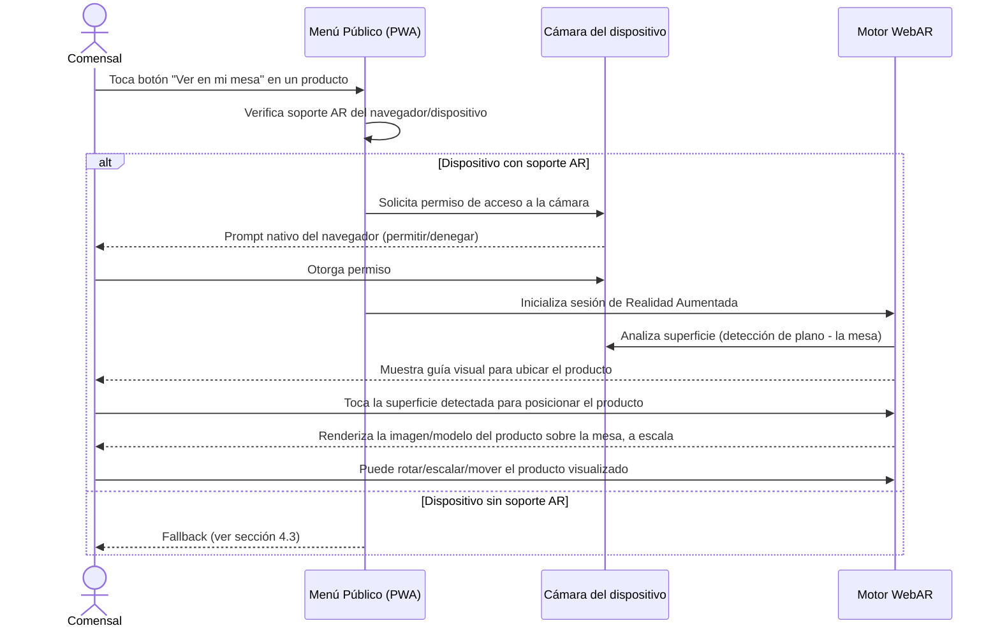

# Especificación de Reglas de Negocio y Features Transversales

> **Documento**: Especificación Funcional Detallada
> **Proyecto**: ProyectoCarta — SaaS Multi-Tenant de Menú Digital PWA para Restaurantes
> **Estado**: Fase de Diseño (sin código de implementación)
> **Relacionado con**: `architecture.md`, `domain-modules.md`

---

## 1. Introducción

Este documento detalla las **reglas de negocio** de las features transversales más complejas del sistema, complementando la descripción estructural de entidades ya realizada en `domain-modules.md`. Se cubren seis áreas:

1. Categorías jerárquicas auto-referenciales.
2. Combos y Promos con precios especiales y temporalidad.
3. WebAR — "Ver en mi mesa".
4. Sistema de Alérgenos y Preferencias Dietéticas.
5. Soporte de internacionalización (i18n).
6. Seguridad y Rate Limiting.

---

## 2. Categorías Jerárquicas Auto-Referenciales

### 2.1 Contexto

Las categorías del `Catalog` (ver `domain-modules.md`) forman un árbol auto-referencial: una `Category` puede tener una `Category` padre, formando cadenas como `Bebidas → Bebidas Calientes → Cafés`.

### 2.2 Reglas de Profundidad

- **No se impone un límite técnico duro de niveles de anidamiento**: el modelo de datos permite profundidad arbitraria (`Category` → `Category` → `Category` → ...).
- **Se recomienda, a nivel de UX/producto, una profundidad práctica recomendada de 3 a 4 niveles** (ej. `Bebidas → Bebidas Calientes → Cafés → Café con Leche`), ya que una jerarquía más profunda degrada la navegabilidad en pantallas pequeñas (principio Mobile-First de `architecture.md`).
- Esta recomendación se implementa como una **advertencia no bloqueante** en el Panel Admin (ej. "Estás creando una categoría muy profunda, ¿estás seguro?"), no como una restricción dura del sistema, para no limitar casos de uso legítimos de cadenas con catálogos muy elaborados.
- **Prohibición absoluta de ciclos**: el sistema debe validar, en cada operación de asignación de categoría padre, que el nuevo padre propuesto no sea descendiente de la categoría que se está moviendo (lo que crearía un ciclo infinito en el árbol). Esta validación se ejecuta recorriendo la cadena de ancestros del padre propuesto.

### 2.3 Reordenamiento (Drag & Drop)

- Cada `Category` mantiene un **campo de orden** (posición relativa) dentro del conjunto de sus hermanas (categorías con el mismo padre).
- El Panel Admin debe ofrecer una interacción de **arrastrar y soltar (drag & drop)** para:
  - Reordenar categorías **hermanas** entre sí (mismo nivel, mismo padre).
  - **Mover una categoría a otro padre** arrastrándola visualmente dentro del árbol, siempre sujeto a la validación anti-ciclos de la sección 2.2.
- Al insertar o mover una categoría entre dos posiciones existentes, el sistema recalcula el campo de orden de forma que se preserve la secuencia relativa del resto de las categorías hermanas sin necesidad de reescribir masivamente todos los registros del árbol.
- El mismo mecanismo de campo de orden aplica también a **Productos dentro de una Categoría**, permitiendo al administrador definir el orden de aparición de los platos en el menú público.

### 2.4 Eliminación de una Categoría Padre con Hijos/Productos

La eliminación de una `Category` que tiene categorías hijas y/o productos asociados es una operación sensible que requiere una decisión explícita del administrador. Se definen las siguientes opciones de resolución, presentadas como decisión obligatoria en el flujo de eliminación del Panel Admin:

| Opción | Comportamiento |
|---|---|
| **Eliminar en cascada** | Se eliminan (o archivan, según política de retención) todas las categorías hijas de forma recursiva y todos los productos exclusivamente asociados a esa rama del árbol. Requiere doble confirmación explícita dado su impacto irreversible. |
| **Reasignar hijos a otra categoría (o a la raíz)** | Las categorías hijas directas y los productos de la categoría eliminada se "adoptan" bajo otra categoría existente elegida por el administrador (o se promueven a categorías raíz si no se elige ninguna). |
| **Archivar en lugar de eliminar** | La categoría y toda su sub-jerarquía pasan a un estado "oculto/archivado" en lugar de eliminarse físicamente, preservando el historial de Analytics asociado y permitiendo una restauración posterior. |

**Regla recomendada por defecto**: el sistema debe **prevenir la eliminación física directa** cuando existan hijos o productos asociados, forzando al administrador a elegir explícitamente entre "Reasignar" o "Eliminar en cascada", evitando eliminaciones accidentales de grandes porciones del catálogo.

### 2.5 Herencia de Disponibilidad y Visibilidad

- Si una `Category` se marca como **oculta** en el menú público, **todas sus categorías hijas y productos descendientes se ocultan automáticamente**, sin necesidad de marcar cada uno individualmente (herencia descendente de visibilidad).
- Si una `Category` se marca como **visible** pero uno de sus productos hijos fue marcado individualmente como oculto, **prevalece la marca más restrictiva** (el producto permanece oculto): la visibilidad efectiva de cualquier nodo del árbol es el resultado de la conjunción (AND lógico) de la visibilidad de sí mismo y de todos sus ancestros.
- La **disponibilidad por Sucursal** sigue la misma lógica de herencia: si una Categoría no está habilitada para la Sucursal X, ningún producto de esa rama se muestra en el menú de esa sucursal, incluso si el producto individualmente está marcado como disponible en esa sucursal (la restricción a nivel categoría es la más alta en la jerarquía de herencia).

### 2.6 Horario de servicio por producto

Un Producto puede definir una ventana diaria opcional (`servedStartMinuteOfDay` / `servedEndMinuteOfDay`, minutos `[0, 1439]`). Si ambos campos son `null`, se sirve todo el día. Van en par: no se acepta solo una hora. El fin es **exclusivo** (a las 15:00 ya no se sirve si el hasta es 15:00) y el rango puede cruzar medianoche, con la misma regla que Happy Hour.

La evaluación es en el **backend**, con la zona IANA de la sucursal (`Branch.timezone`), nunca con el reloj del celular del comensal ni con el del servidor. Fuera de la ventana el plato **sigue visible** en la carta, atenuado, con `outsideServingHours: true` y la etiqueta “Fuera de horario”. No se pisa el enum `availability`: un plato `OUT_OF_STOCK` sigue “No disponible” aunque esté en horario.

---

## 3. Combos y Promos: Precios Especiales y Temporalidad

### 3.1 Cálculo del Precio de un Combo

- **El precio de un Combo NO se calcula automáticamente como la suma de los precios individuales de sus productos componentes.** Se define explícitamente como un campo propio del Combo (ver `domain-modules.md`).
- **Justificación de negocio**: los combos suelen representar una estrategia comercial deliberada (ej. "vender más volumen a menor margen unitario") que no siempre sigue una fórmula matemática simple sobre los precios base; el administrador necesita control total sobre el precio final ofrecido.
- Como **ayuda de UX en el Panel Admin** (no como regla de cálculo automática obligatoria), se recomienda mostrar de forma informativa: *"Precio suma de items individuales: $X — Precio del combo: $Y — Ahorro para el cliente: $Z (W%)"*, para que el administrador tome una decisión de pricing informada al momento de crear o editar el combo.
- Si el precio base de uno de los productos que integra un Combo cambia posteriormente, **el precio del Combo NO se recalcula automáticamente**: permanece fijo en el valor definido explícitamente hasta que el administrador lo actualice manualmente. Esto evita fluctuaciones de precio no controladas en una oferta que el comensal percibe como "cerrada".

### 3.2 Reglas de Solapamiento de Promos

Un mismo `Product` puede estar alcanzado simultáneamente por múltiples `Promo` y/o `Happy Hour` vigentes al mismo tiempo (ej. una Promo de temporada + un Happy Hour semanal). Se definen las siguientes reglas de resolución:

1. **Campo de Prioridad explícito**: cada Promo/Happy Hour tiene un valor numérico de prioridad. Ante solapamiento sobre el mismo producto, **se aplica únicamente la promoción de mayor prioridad** (no se acumulan descuentos por defecto, para evitar precios finales absurdamente bajos por acumulación no intencional).
2. **Regla de desempate por especificidad**: si dos promociones solapadas tienen la misma prioridad numérica, se aplica la que tenga **el alcance más específico** (una promo dirigida directamente a un Product específico tiene precedencia sobre una que alcanza a ese producto de forma heredada a través de su Category).
3. **Regla de desempate final por recencia**: si persiste el empate tras aplicar especificidad, se aplica la promoción **creada más recientemente**, como criterio de último recurso determinístico.
4. **No acumulación implícita**: el sistema **no combina/suma automáticamente** los porcentajes o montos de descuento de dos promociones distintas sobre el mismo producto. Si el negocio realmente desea un descuento combinado, debe modelarse como una única Promo con el valor final deseado.
5. **Transparencia al comensal**: cuando un producto tiene una promoción activa, la interfaz pública debe indicar claramente el motivo (ej. una etiqueta "Happy Hour" o "Promo" con el nombre correspondiente), evitando ambigüedad sobre por qué el precio mostrado difiere del precio de lista.

En la carta pública el orden de secciones es: **Happy Hour** (solo si hay al menos un plato cuya oferta ganadora es un Happy Hour vigente) → **Combos** → **categorías/productos** en el orden configurado por el dueño. Un plato en Happy Hour también sigue apareciendo en su categoría, con el mismo precio ganador (no se acumulan descuentos). Un Happy Hour nuevo arranca con prioridad `10` y una Promo con `0`, para que durante el horario del Happy Hour gane ese descuento si el dueño no indica lo contrario.

### 3.3 Ventanas de Vigencia

- **Promo estándar**: definida por una **fecha/hora de inicio** y una **fecha/hora de fin** explícitas (ventana continua, no recurrente). Transiciona automáticamente por los estados: `programada` (fecha de inicio en el futuro) → `activa` (dentro de la ventana) → `expirada` (fecha de fin en el pasado).
- **Happy Hour**: definida por **uno o más días de la semana** más un **rango horario** (hora de inicio y hora de fin) que se repite indefinidamente cada semana mientras el Happy Hour permanezca habilitado. No tiene una "fecha de fin" en el sentido tradicional; se desactiva mediante un flag de habilitación explícito, no por vencimiento de una fecha concreta.
- **Evaluación en tiempo real**: la determinación de si una Promo/Happy Hour está actualmente activa debe evaluarse en el **backend**, en el momento de servir el menú (o mediante un proceso periódico de recálculo de estado), nunca confiando en el reloj del dispositivo del comensal, para evitar manipulación del precio mostrado mediante un reloj de dispositivo alterado.
- **Zona horaria de la sucursal**: Happy Hour y el horario de servicio de productos usan `Branch.timezone` (IANA, por defecto `America/Argentina/Buenos_Aires`). Se edita en `/admin/settings`. No es la zona del servidor ni la del dispositivo del comensal.
- **Rango horario que cruza la medianoche**: un Happy Hour puede definirse con un rango horario que atraviesa la medianoche (ej. 23:00–01:00); el motor de evaluación debe tratar este caso especial correctamente, considerando dos tramos: desde la hora de inicio hasta las 23:59:59 de un día, y desde las 00:00:00 hasta la hora de fin del día siguiente.

### 3.4 Cambio del Precio Base Durante una Promo Activa

Se definen dos comportamientos posibles según el tipo de descuento de la Promo, dado que tienen implicancias distintas:

| Tipo de descuento de la Promo | Comportamiento ante cambio del precio base del producto |
|---|---|
| **Porcentual** (ej. -20%) | El descuento se sigue aplicando **sobre el nuevo precio base** de forma dinámica; el precio final mostrado al comensal cambia automáticamente para reflejar el nuevo precio base con el mismo porcentaje de descuento. |
| **Monto fijo** (ej. -$500) | El monto fijo se resta del **nuevo precio base**; si el nuevo precio base es menor al monto fijo de descuento, el sistema debe evitar un precio final negativo, aplicando como mínimo un precio final de $0 o, preferentemente, alertando al administrador para revisión manual. |
| **Precio fijo promocional** (sobrescribe el precio base) | El precio mostrado **permanece igual al valor fijo promocional configurado**, sin verse afectado por el cambio del precio base del producto, ya que la promo no depende matemáticamente del precio base sino que lo reemplaza directamente. |

En todos los casos, el Panel Admin muestra las ofertas que alcanzan un producto en el formulario de edición (`GET /api/v1/admin/engagement/product-offers`), con el precio de lista vs. el precio final y acciones de editar/eliminar. El precio de lista del producto no se modifica al crear o borrar una promo.

---

## 4. WebAR — "Ver en mi mesa"

### 4.1 Flujo de Usuario

1. El comensal, dentro de la vista de detalle de un Producto habilitado para AR, toca el botón **"Ver en mi mesa"**.
2. La aplicación verifica si el navegador/dispositivo actual soporta las APIs de Realidad Aumentada Web requeridas.
3. Si hay soporte, se solicita permiso de acceso a la cámara mediante el flujo nativo estándar del navegador.
4. El motor de AR activa la **detección de superficies planas** (ej. la mesa del restaurante) usando la cámara en tiempo real.
5. Se muestra una guía visual (ej. un retículo o sombra) indicando dónde se posicionará el producto una vez que el comensal confirme la ubicación.
6. Al tocar la superficie detectada, se renderiza sobre la imagen de cámara en vivo la **imagen/asset del producto con fondo transparente** (generado por el pipeline de IA del dominio Media & AR), a una escala realista aproximada.
7. El comensal puede interactuar básicamente con la proyección (rotar, acercar/alejar) antes de cerrar la experiencia y volver al menú.

### 4.2 Requisitos Técnicos de Alto Nivel

- **Tecnología base recomendada**: uso de estándares web abiertos de Realidad Aumentada (familia **WebXR Device API** con el módulo de AR, o librerías complementarias de detección de superficies tipo **AR.js** como capa de compatibilidad en dispositivos/navegadores donde WebXR AR no esté disponible de forma nativa). La elección final de librería específica se define en la fase de implementación técnica, no en este documento de diseño.
- **Formato del asset visual**: imágenes **PNG o WebP con canal alfa (fondo transparente)**, generadas por el pipeline de recorte de fondo con IA descrito en `domain-modules.md` (dominio Media & AR). El listado del menú **siempre** usa una imagen 2D liviana (foto de presentación). No se exige, para el alcance inicial, un modelo 3D por plato: la experiencia base es una **proyección plana ("cutout") con perspectiva**.
- **Capa premium opcional (modelo 3D)**: un producto puede adjuntar, **además** de la foto de presentación, un archivo `.glb`/`.usdz` en un `MediaAsset` distinto (`ProductMedia.role = AR_MODEL`). Ese modelo alimenta el visor AR ("Ver en tu mesa") y **nunca reemplaza** la imagen 2D del listado. Foto y modelo conviven; cada uno se puede quitar por separado desde el panel admin. Como ayuda de UX (el escaneo 3D no es un flujo habitual de un restaurante), el formulario de producto incluye una guía plegable: qué es la experiencia, apps de ejemplo (Polycam, Scaniverse, Luma AI) y el proceso de captura con el celular.
- **Detección de superficie (plane detection)**: requisito indispensable para lograr que la imagen del producto se "apoye" visualmente sobre la mesa real y no simplemente flote superpuesta sin anclaje espacial.
- **Rendimiento**: dado que la sesión de AR involucra procesamiento de cámara en tiempo real, se debe optimizar el asset (tamaño de imagen, ausencia de animaciones pesadas) para no degradar el framerate en dispositivos de gama media/baja, coherente con el principio Mobile-First de `architecture.md`.

### 4.3 Fallbacks para Navegadores/Dispositivos sin Soporte AR

No todos los comensales tendrán un dispositivo o navegador compatible con WebXR/AR. Se define una estrategia de degradación progresiva:

1. **Nivel 1 (ideal)**: soporte completo de WebXR AR — experiencia descrita en la sección 4.1.
2. **Nivel 2 (fallback intermedio)**: si el dispositivo tiene cámara pero no soporta las APIs de AR necesarias, se ofrece una **vista de "cuasi-AR" simplificada**: se muestra el feed de la cámara en vivo con la imagen del producto superpuesta en el centro de la pantalla sin anclaje espacial real (el comensal debe mover el teléfono manualmente para simular el efecto), acompañada de un control manual de escala/posición.
3. **Nivel 3 (fallback básico)**: si no hay soporte de cámara/AR en absoluto (ej. algunos navegadores de escritorio, o el comensal deniega el permiso de cámara), se muestra una **galería ampliada de alta resolución** del producto (múltiples ángulos si están disponibles) como alternativa informativa, sin pretender simular AR.
4. En todos los niveles, el botón "Ver en mi mesa" debe comunicar de forma clara y anticipada qué tipo de experiencia recibirá el comensal antes de solicitar permisos de cámara, evitando solicitudes de permiso innecesarias en dispositivos donde ya se sabe que no hay soporte real de AR (detección de capacidades realizada antes de disparar cualquier prompt de permisos).

---

## 5. Sistema de Alérgenos y Preferencias Dietéticas

### 5.1 Catálogo de Alérgenos Comunes

Se define un catálogo base de alérgenos estandarizado a nivel plataforma (no editable libremente por cada tenant, para mantener consistencia e iconografía reconocible entre distintos menús), incluyendo al menos:

- Gluten
- Lácteos / Derivados de la leche
- Frutos secos
- Maní (cacahuate)
- Mariscos / Crustáceos
- Pescado
- Huevo
- Soja
- Sésamo
- Sulfitos

### 5.2 Catálogo de Preferencias Dietéticas

De forma análoga, un catálogo base de preferencias/estilos dietéticos, también estandarizado a nivel plataforma:

- Vegano
- Vegetariano
- Sin TACC (libre de gluten, terminología usada en mercados de habla hispana)
- Keto / Bajo en carbohidratos
- Sin azúcar añadida
- Apto para diabéticos (a validar terminología con criterio médico/regulatorio en fase de implementación)

### 5.3 Modelo de Asignación (Tags)

- Tanto los Alérgenos como las Preferencias Dietéticas se modelan como **tags reutilizables** definidos una sola vez a nivel plataforma, y se **asignan por relación muchos-a-muchos** a:
  - **Productos** (nivel principal de asignación).
  - **Variantes/Opciones** específicas de un producto (ej. una opción "Leche de almendras" dentro del grupo de variante "Tipo de leche" podría anular el alérgeno "Lácteos" que tiene el producto base, o agregar el tag "Vegano" solo para esa combinación específica — este nivel de granularidad se define como **extensión futura**, siendo la asignación a nivel Producto el requisito del MVP).
- Un Producto puede tener **cero, uno o múltiples tags** de alérgenos y de preferencias dietéticas simultáneamente.
- El Panel Admin asigna esos tags en el formulario de producto, cargando el catálogo de plataforma con `GET /api/v1/admin/catalog/tags` (`api-contracts.md`).
- La ausencia de un tag de alérgeno **no debe interpretarse como garantía absoluta de ausencia de ese alérgeno** (contaminación cruzada en cocina, cambios de proveedor, etc.); se recomienda incluir un **disclaimer legal visible** en el menú público indicando que la información es orientativa y que el comensal debe consultar directamente al staff ante alergias severas. Este disclaimer es una decisión de producto/legal a validar, pero se documenta aquí como requisito de la especificación funcional.

### 5.4 Filtros Instantáneos en el Menú Público

- El comensal debe poder activar **uno o varios filtros simultáneos** (ej. "Sin gluten" + "Vegano") desde la interfaz del menú público.
- **El filtrado debe ejecutarse enteramente en el cliente (client-side)**, sobre el catálogo ya cargado/cacheado localmente (alineado con la estrategia PWA offline-first de `architecture.md`), para que la respuesta visual sea **instantánea**, sin requerir un nuevo round-trip al backend por cada cambio de filtro.
- Esto implica que el payload del menú entregado al PWA debe incluir, para cada Producto, la lista completa de sus tags de alérgenos/dietas de forma embebida, evitando llamadas adicionales para resolver esta información en el momento del filtrado.
- Los productos que no cumplen el/los filtro(s) activos se ocultan de la vista (o se atenúan visualmente, decisión de UX a definir), pero **no se recalculan desde el servidor**: toda la lógica de coincidencia de filtros corre en el dispositivo del comensal.

---

## 6. Soporte de Internacionalización (i18n)

### 6.1 Estrategia de Traducción de Menús

Se define un modelo de **traducción manual por campo, con asistencia opcional de traducción automática** como acelerador (no como fuente de verdad definitiva):

- El administrador del Tenant define el **idioma por defecto** (heredado de la configuración de Tenant/Branch, ver `domain-modules.md`) en el cual introduce naturalmente los contenidos de su menú.
- Para cada idioma adicional que el Tenant desee ofrecer (según límites de su Plan), el Panel Admin debe permitir **completar manualmente la traducción de cada campo traducible**, campo por campo, para garantizar precisión (especialmente relevante en gastronomía, donde nombres de platos y descripciones suelen tener matices culturales que una traducción automática literal puede arruinar).
- **Integración opcional con un servicio de traducción automática** (a definir en implementación) puede ofrecerse como una acción de **"traducir automáticamente como borrador"**, pre-completando los campos vacíos con una sugerencia editable, que el administrador debe revisar y confirmar antes de publicar. La traducción automática nunca se publica directamente sin paso de revisión humana, para evitar errores embarazosos en un contexto comercial (ej. nombres de platos mal traducidos).

### 6.2 Entidades Traducibles

Se consideran traducibles, como mínimo, los siguientes campos textuales (ver entidades correspondientes en `domain-modules.md`):

| Entidad | Campos traducibles |
|---|---|
| **Category** | Nombre, Descripción |
| **Product** | Nombre, Descripción |
| **Combo** | Nombre, Descripción |
| **Promo / Happy Hour** | Nombre, Descripción (texto mostrado al comensal, ej. "2x1 en cervezas") |
| **Variant (grupo y opciones)** | Nombre del grupo, Nombre de cada opción |
| **Alérgenos / Preferencias Dietéticas** | Nombre del tag (traducción gestionada centralmente a nivel plataforma, no por tenant, dado que son catálogos estandarizados) |

Campos no traducibles por naturaleza (ej. precios, fechas, colores de marca, URLs de imágenes) quedan explícitamente fuera de este mecanismo.

### 6.3 Selección de Idioma por el Comensal

- El menú público debe ofrecer un **selector de idioma visible y accesible** (ej. un ícono de bandera/globo en el header), sin necesidad de recargar la aplicación completa.
- El idioma seleccionado por el comensal se recuerda **localmente en el dispositivo** (para persistir la preferencia entre visitas al mismo tenant) pero no requiere cuenta de usuario ni backend para almacenarse, coherente con el acceso anónimo del comensal.
- Si un contenido específico no tiene traducción disponible en el idioma seleccionado por el comensal, el sistema debe **hacer fallback automático al idioma por defecto del Tenant/Sucursal**, nunca mostrando un campo vacío.

### 6.4 Idioma por Defecto por Tenant/Sucursal

- Cada **Tenant** define un idioma por defecto general.
- Cada **Sucursal** puede **sobrescribir** el idioma por defecto del Tenant (relevante para cadenas con locales en distintos países/regiones con idioma predominante distinto).
- El idioma por defecto determina: (a) en qué idioma se le presenta el menú a un comensal que no ha expresado ninguna preferencia explícita, y (b) cuál es el "idioma fuente" que el administrador debe completar obligatoriamente antes de habilitar traducciones adicionales (no tiene sentido traducir un campo que ni siquiera existe en el idioma base).

---

## 7. Seguridad y Rate Limiting

### 7.1 Acceso Público de Solo Lectura (Comensal)

- El menú público **no requiere autenticación de ningún tipo**: cualquier persona con el enlace/QR puede visualizarlo.
- Todas las operaciones disponibles para el comensal son de **solo lectura** sobre el catálogo (ver, filtrar, cambiar idioma, activar AR) más el **registro de eventos de Analytics** (que es una escritura acotada y de propósito único, no una modificación del dominio de negocio).
- No existe, en el alcance de este sistema, ningún flujo transaccional de pedido/compra que requiera identificar al comensal (el sistema es un menú digital informativo/promocional, no un sistema de pedidos ni de pagos).

### 7.2 JWT para el Panel Admin

- Todo acceso al Panel Admin (`PLATFORM_ADMIN`, Owners, Admins, Staff) requiere **autenticación mediante JWT de aplicación emitido por NestJS**. Supabase Auth no se usa en el MVP (`architecture.md` §2.3).
- La identidad visual de la carta (nombre comercial, color primario, logo, portada, contacto de sucursal) y el **estado operativo de la sucursal** (`OPEN` / `CLOSED_TEMPORARILY` / `MAINTENANCE`) se editan en `/admin/settings` contra `GET`/`PATCH /api/v1/admin/settings/branch` (`api-contracts.md` §5.10). La sucursal que se edita es la **activa en el panel** (`X-Branch-Id`; alta de locales en `/admin/branches`, `api-contracts.md` §5.12). Al crear un local extra se copia la disponibilidad acotada del catálogo desde otra sucursal del mismo Tenant. Un local cerrado o en mantenimiento muestra un aviso en la carta; **el enlace sigue resolviendo**. Cortar la URL por falta de pago es `Tenant.status = SUSPENDED` desde `/admin/platform` (`PATCH /api/v1/admin/platform/tenants/:id/status`). El logo y el banner se suben (y se pueden quitar) por endpoints de media, no como URLs libres. En el menú público, la cabecera usa la portada como fondo, el logo redondeado, el nombre comercial y atajos a Instagram/WhatsApp; el color primario se inyecta como `--primary-color` en el host de la carta. Dirección y teléfono quedan en un pie discreto. El QR de la sucursal se genera en el cliente en esa misma pantalla, apuntando a `/m/:tenantSlug/:branchSlug`.
- El token emitido debe incluir, como mínimo (a nivel conceptual de claims, sin especificar formato de implementación; contrato en `api-contracts.md` §4.5):
  - Identificador del Usuario autenticado (`sub`).
  - Identificador del Tenant al que pertenece la sesión activa, o `null` si el usuario es `PLATFORM_ADMIN` (operador de plataforma, fuera del aislamiento de un tenant).
  - Rol(es) efectivo(s) del usuario, incluyendo alcance `PLATFORM` / `TENANT` / `BRANCH` y posibles asignaciones diferenciadas por Sucursal (ver `domain-modules.md`, dominio Tenant).
  - Tiempo de expiración acotado (~15 min), con mecanismo de renovación (refresh token **opaco**, rotativo, entregado en cookie `HttpOnly` + `Secure` + `SameSite=Strict`) para no forzar reautenticaciones frecuentes durante una jornada de trabajo del staff.
- El `accessToken` vive solo en memoria en el cliente (`AuthStore`); nunca en `localStorage`.
- **Cada request administrativa debe validar dos condiciones de forma independiente**: (a) que el JWT sea válido y no haya expirado, y (b) que el Rol codificado en el JWT tenga permiso explícito para la acción/recurso solicitado (autorización granular por Rol, RBAC), rechazando con un error de autorización (no de autenticación) cuando el usuario está autenticado pero no habilitado para esa acción específica. El `tenantId` operable de un usuario de tenant sale **solo** de los claims, nunca del body/params.

### 7.3 Rate Limiting en Endpoints Públicos

- Los endpoints públicos (consulta de menú, registro de eventos de analítica) deben estar protegidos por **límites de tasa de peticiones (rate limiting)** para mitigar:
  - **Scraping masivo del catálogo** por parte de competidores o bots (ej. extracción sistemática de precios y productos).
  - **Abuso/spam de eventos de Analytics** que distorsionen las métricas reportadas a los tenants.
- El límite se aplica preferentemente por una combinación de **dirección IP + identificador de sesión anónima + Tenant/Sucursal objetivo**, para diferenciar tráfico legítimo distribuido (muchos comensales reales en un mismo restaurante concurrido) de un patrón de abuso concentrado (un mismo origen consultando agresivamente).
- Al superar el límite, el sistema debe responder de forma controlada (código de error estándar de "demasiadas peticiones") sin exponer detalles internos de la infraestructura, y aplicar backoff progresivo ante reintentos persistentes desde el mismo origen.

### 7.4 Rate Limiting Diferenciado por Plan

- Los límites de tasa no son uniformes para toda la plataforma: **cada Plan de suscripción define su propio umbral de rate limiting** (ver `domain-modules.md`, dominio Tenant), reflejando el volumen de tráfico esperado según el nivel de servicio contratado.
- Esto cumple una doble función:
  1. **Protección técnica**: evita que un tenant de plan básico consuma recursos desproporcionados de la infraestructura compartida (alineado con la estrategia Shared Schema descrita en `architecture.md`).
  2. **Palanca comercial**: un tenant con alto tráfico real (ej. una cadena grande) tiene un incentivo de negocio genuino para migrar a un plan superior con mayores límites, en lugar de degradar su servicio en el plan básico.

### 7.5 Protección de Endpoints de Analytics (Anti-Fraude)

- Los endpoints que reciben `ScanEvent` e `InteractionEvent` (ver `domain-modules.md`, dominio Analytics) requieren controles adicionales más allá del rate limiting genérico, dado que son un vector directo de manipulación de métricas que los tenants usan para tomar decisiones de negocio:
  - **Validación de pertenencia**: el tenant/sucursal salen de la ruta pública, no del body. Un `AR_VIEW_CLICK` referencia un producto que existe en ese Tenant.
  - **Deduplicación por sesión anónima**: un `scan` por `sessionId` (carga de página) y sucursal; search/filter/AR iguales en una ventana corta; `SESSION_DWELL` conserva el mayor `durationMs`. Un refresh del navegador es otra visita.
  - **Límite de eventos por sesión anónima**: una sesión no puede generar un volumen de eventos irrazonablemente alto en un período corto, lo cual sería indicativo de un script automatizado en lugar de un comensal real navegando el menú. El corte actual cubre dedup + `ThrottlerGuard` por IP/`Plan.rateLimitPerMinute`; el tope extra por `sessionId` queda para después.

### 7.6 CORS y Consideraciones Multi-Tenant en Dominios

- Dado que un Tenant puede operar bajo **subdominio propio** o **dominio personalizado** (ver `architecture.md`, sección de resolución de tenant), la configuración de **CORS no puede ser una lista estática fija** de orígenes permitidos.
- Se requiere una **validación dinámica de origen**: el backend debe resolver, para cada request entrante, si el dominio/subdominio de origen corresponde a un Tenant válido y activo en la plataforma, permitiendo la petición únicamente en ese caso.
- Los dominios personalizados de tenants en planes superiores deben pasar por un **proceso de verificación de propiedad del dominio** (a nivel conceptual, ej. validación DNS) antes de ser aceptados como origen válido para CORS, evitando que un tercero no autorizado registre un dominio personalizado apuntando a un Tenant que no le pertenece.
- Las cookies/headers de sesión del **Panel Admin** deben configurarse con los atributos de seguridad estándar recomendados (alcance restringido, transmisión solo bajo HTTPS, protección contra ataques de tipo Cross-Site Request Forgery) dado que a diferencia del menú público, el Panel Admin maneja sesiones autenticadas con capacidad de modificar datos de negocio reales.

---

## 8. Resumen de Reglas Críticas (Checklist de Diseño)

| # | Regla | Dominio relacionado |
|---|---|---|
| 1 | No se permiten ciclos en la jerarquía de Categorías | Catalog |
| 2 | Eliminar una Categoría con hijos requiere elección explícita (cascada / reasignar / archivar) | Catalog |
| 3 | La visibilidad se hereda de forma descendente y restrictiva en el árbol de Categorías | Catalog |
| 4 | El precio de un Combo es explícito, nunca calculado automáticamente | Catalog / Engagement |
| 5 | Solapamiento de Promos se resuelve por prioridad → especificidad → recencia, sin acumulación implícita | Engagement |
| 6 | Happy Hour se evalúa en la zona horaria de la Sucursal, con soporte de rangos que cruzan la medianoche | Engagement |
| 7 | WebAR usa imágenes 2D con fondo transparente (no requiere modelos 3D) con fallback progresivo de 3 niveles | Media & AR |
| 8 | Filtrado de alérgenos/dietas es 100% client-side para respuesta instantánea | Catalog / Frontend |
| 9 | Traducciones son manuales con asistencia opcional de traducción automática revisable | i18n |
| 10 | Menú público sin autenticación; Panel Admin con JWT de NestJS + RBAC (`PLATFORM_ADMIN` / `OWNER` / `ADMIN` / `STAFF`); refresh en cookie HttpOnly | Seguridad |
| 11 | Rate limiting diferenciado por Plan, con controles anti-fraude específicos en Analytics | Seguridad / Tenant |
| 12 | CORS con validación dinámica de origen por Tenant (subdominios y dominios personalizados) | Seguridad / Tenant |

---

*Fin de `features-spec.md`. Este documento, junto a `architecture.md` y `domain-modules.md`, constituye la especificación de diseño completa de la fase actual del proyecto ProyectoCarta.*
