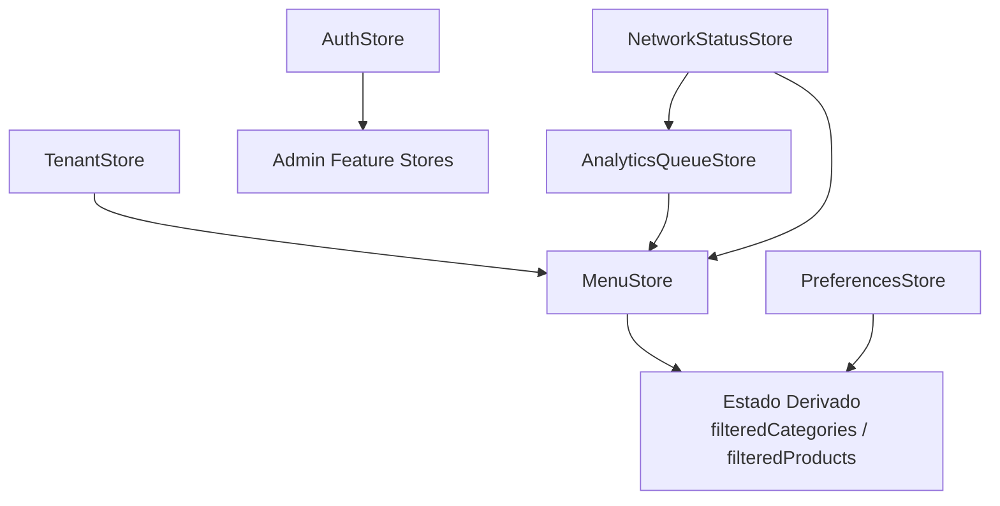
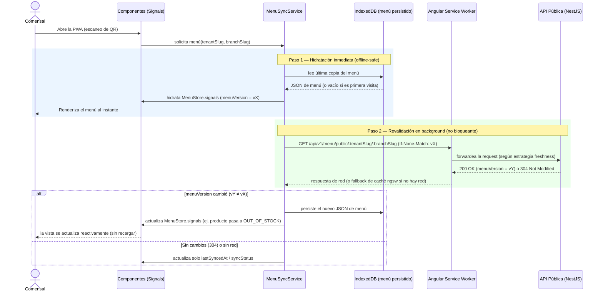
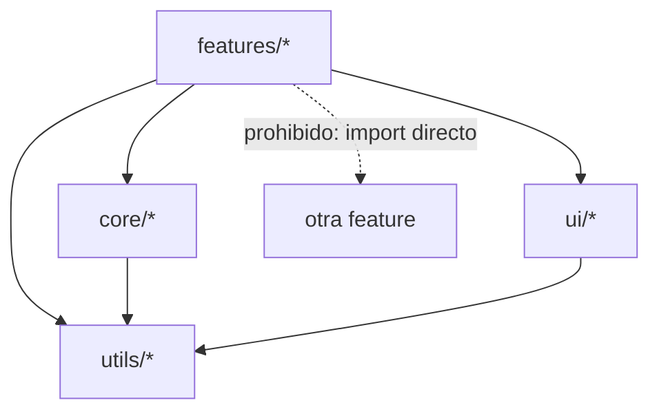

# Arquitectura Frontend — Angular 19 (PWA Comensal + Panel Admin)

> **Documento**: Especificación de Arquitectura Frontend
> **Proyecto**: ProyectoCarta — SaaS Multi-Tenant de Menú Digital PWA para Restaurantes
> **Estado**: Fase de Diseño (diseño estructural, sin código de componentes)
> **Relacionado con**: `architecture.md`, `api-contracts.md`, `.cursor/rules/02-frontend-angular.mdc`

---

## 1. Introducción y Alcance

Este documento diseña la **arquitectura interna del frontend Angular 19** que consume los contratos definidos en `api-contracts.md`. Cubre tres aspectos:

1. **Gestión de estado con Signals** (sin NgRx, sin RxJS para estado local — ver `.cursor/rules/02-frontend-angular.mdc`).
2. **Arquitectura Offline-First** con Service Worker + `IndexedDB`, implementando el patrón *Stale-While-Revalidate* definido en `architecture.md` §4.2.
3. **Estructura de carpetas** del directorio `apps/web/src`, siguiendo un patrón moderno de Standalone Components.

No se define aquí ningún componente, template, decorador ni firma de servicio concreta: solo la forma estructural (stores, capas, carpetas) y el flujo de datos entre ellas.

---

## 2. Estrategia de State Management (Signals)

### 2.1 Principio General

Todo el estado de aplicación reside en **Stores** (servicios `Injectable` con alcance `root`, o de alcance de feature cuando corresponda) que exponen **Signals de solo lectura** hacia los componentes, y métodos explícitos para mutarlos internamente. Ningún componente escribe directamente sobre un signal de estado global: siempre lo hace a través de un método del Store correspondiente. Esto reemplaza el rol que tradicionalmente cumpliría un store de NgRx, sin la sobrecarga de reducers/actions/effects.

### 2.2 Mapa de Stores Globales



| Store | Alcance | Consumido por |
|---|---|---|
| `TenantStore` | Global (App Pública) | Toda la app pública (branding, resolución de tenant/sucursal) |
| `MenuStore` | Global (App Pública) | Feature `menu-public`, `web-ar` |
| `PreferencesStore` | Global (App Pública + Admin) | Filtros de alérgenos, idioma, tema |
| `NetworkStatusStore` | Global (compartido) | `MenuStore`, `AnalyticsQueueStore`, indicador de UI "offline" |
| `AnalyticsQueueStore` | Global (App Pública) | Registro/reintento de eventos de Analytics |
| `AuthStore` | Global (Panel Admin) | Guards, interceptor de Authorization, feature `admin-*` |

### 2.3 `TenantStore`

Responsable de mantener el contexto de Tenant/Sucursal resuelto para la sesión de navegación actual del comensal (equivalente al bloque `tenant`/`branch`/`meta` de la respuesta de `GET /api/v1/menu/public/...` en `api-contracts.md` §3.5).

| Signal | Descripción |
|---|---|
| `tenant` | Datos de branding del Tenant activo (`slug`, `name`, `primaryColor`, `logoUrl`) o `null` mientras se resuelve. |
| `branch` | Datos de la Sucursal activa (`slug`, `name`, `timezone`, `operationalStatus`). |
| `features` | Flags de plan (`webArEnabled`, `i18nEnabled`) usados para mostrar/ocultar features condicionalmente en UI. |
| `resolutionStatus` | `idle \| resolving \| resolved \| notFound \| suspended`, refleja los casos de error de `api-contracts.md` §3.7. |

### 2.4 `MenuStore`

Es el store de mayor responsabilidad de la app pública: mantiene la **última versión conocida del menú**, ya sea servida desde red o desde `IndexedDB` (ver §3).

| Signal | Descripción |
|---|---|
| `categoriesTree` | Árbol de categorías tal como llega en el contrato (anidado, con productos embebidos por nodo). |
| `combos` | Lista de combos disponibles. |
| `allergenCatalog` / `dietaryTagCatalog` | Catálogos estandarizados de plataforma, embebidos una sola vez (ver `api-contracts.md` §3.6). |
| `menuVersion` | Hash de versión del menú, usado como `ETag` lógico para decidir si hubo cambios tras revalidar. |
| `syncStatus` | `hydratingFromCache \| synced \| revalidating \| offline \| error`. Alimenta el indicador visual de "modo offline" exigido por `features-spec.md` §4.2. |
| `lastSyncedAt` | Timestamp de la última sincronización exitosa con el backend. |

`MenuStore` **no** expone signals separados por producto individual; los productos viven embebidos dentro de `categoriesTree`/`combos`, igual que en el contrato de API, para evitar mantener dos formas paralelas de la misma información (fuente única de verdad).

### 2.5 `PreferencesStore`

Mantiene preferencias del comensal, persistidas en `localStorage` (no requieren backend, en línea con el acceso anónimo de `features-spec.md` §7.1).

| Signal | Descripción |
|---|---|
| `selectedLanguage` | Idioma activo elegido por el comensal (o el `defaultLanguage` del Tenant/Sucursal si no eligió ninguno). |
| `activeAllergenFilters` | Set de `allergenId` que el comensal quiere **excluir**. |
| `activeDietaryFilters` | Set de `dietaryTagId` que el comensal quiere **incluir** (ej. "solo Vegano"). |
| `arConsentGiven` | Si el comensal ya otorgó permiso de cámara en esta sesión (evita reprompt innecesario, `features-spec.md` §4.3). |

### 2.6 `NetworkStatusStore` y `AnalyticsQueueStore`

- `NetworkStatusStore` expone un único signal `isOnline`, derivado de los eventos nativos `online`/`offline` del navegador, consumido por `MenuStore` (para decidir si intentar revalidar) y por `AnalyticsQueueStore` (para decidir si vaciar la cola pendiente).
- `AnalyticsQueueStore` mantiene un signal `pendingEventsCount` y encola internamente los eventos de `ScanEvent`/`InteractionEvent` generados offline, para reenviarlos vía Background Sync cuando `NetworkStatusStore.isOnline()` vuelve a `true` (ver `architecture.md` §4.2, fila "Analítica").

### 2.7 `AuthStore` (Panel Admin)

Espeja el contrato de `POST /api/v1/admin/auth/login` (`api-contracts.md` §4.4): mantiene `accessToken` en memoria (nunca en `localStorage`, por seguridad), `currentUser`, `roleAssignments` y `accessibleBranches` como signals, más un signal derivado `currentRoleForActiveBranch` usado por los guards de ruta del Panel Admin.

### 2.8 Estado Derivado (Computed Signals)

El estado derivado se modela exclusivamente con `computed()`, nunca duplicando manualmente datos entre stores. Los casos principales:

| Signal derivado | Depende de | Fórmula conceptual |
|---|---|---|
| `filteredCategoriesTree` | `MenuStore.categoriesTree`, `PreferencesStore.activeAllergenFilters`, `PreferencesStore.activeDietaryFilters` | Recorre el árbol y devuelve una copia filtrada: oculta productos que contengan algún alérgeno excluido o que no cumplan los tags dietéticos requeridos; una categoría sin productos visibles tras el filtro también se oculta (consistente con la herencia de visibilidad de `features-spec.md` §2.5). |
| `resolvedProductLabel(productId)` | `MenuStore`, `PreferencesStore.selectedLanguage` | Selecciona la traducción correspondiente al idioma activo, con fallback al idioma por defecto del Tenant/Sucursal si falta esa clave (`features-spec.md` §6.3). |
| `hasActiveFilters` | `PreferencesStore.activeAllergenFilters`, `activeDietaryFilters` | `true` si algún set tiene al menos un elemento; controla la visibilidad del botón "Limpiar filtros". |
| `isMenuStale` | `MenuStore.lastSyncedAt`, `NetworkStatusStore.isOnline` | Indica si deben mostrarse señales visuales sutiles de "estás viendo una versión offline" cuando el último sync es antiguo y no hay red. |

Porque todo el filtrado ocurre sobre datos ya cacheados localmente y mediante `computed()`, la actualización de la UI ante un cambio de filtro es **síncrona e instantánea**, sin ningún round-trip de red, cumpliendo el requisito de `features-spec.md` §5.4.

---

## 3. Arquitectura Offline-First (Service Worker + IndexedDB)

### 3.1 Dos capas de caché complementarias

Se combinan **dos mecanismos de caché con responsabilidades distintas**, evitando que uno sustituya al otro:

1. **Angular Service Worker (`ngsw`)** — capa de bajo nivel, cachea el *shell* de la aplicación (JS/CSS/HTML del build) y assets estáticos (imágenes de Cloudinary) como blobs HTTP opacos. Es la capa que garantiza que la PWA **arranque** sin red.
2. **`IndexedDB` (a través de un wrapper ligero, ej. tipo `idb`)** — capa de datos estructurados, donde se persiste la **última versión conocida y ya parseada del JSON de menú**. Es la fuente de verdad que hidrata directamente los signals de `MenuStore`, porque a diferencia del caché HTTP de `ngsw`, permite leer y comparar el contenido (no solo servir un blob).

Esta separación es intencional: el caché de `ngsw` no ofrece un hook nativo para "avisar a la app que el dato cacheado cambió"; por eso la orquestación real del patrón *Stale-While-Revalidate* vive en una capa de aplicación (`MenuSyncService`, dentro de `core/services`), no únicamente en la configuración declarativa de `ngsw-config.json`.

### 3.2 Configuración declarativa de `ngsw-config.json` (nivel lógico)

| Grupo de datos | Patrón | Estrategia `ngsw` | Justificación |
|---|---|---|---|
| `app-shell` | build de Angular (JS/CSS/HTML) | `installMode: prefetch` | Debe estar disponible instantáneamente offline desde la primera visita. |
| `menu-images` | assets de Cloudinary de productos/categorías | `performance` (cache-first, `maxAge` largo) | Coincide con `architecture.md` §4.2, fila "Imágenes de productos". |
| `menu-api-raw` | `GET /api/v1/menu/public/**` | `freshness` (network-first con timeout corto, fallback a caché) | Capa de resiliencia adicional a nivel HTTP; el timeout evita que una red lenta bloquee la carga inicial. |
| `admin-api` | `/api/v1/admin/**` | **Excluido explícitamente de cacheo persistente** | Los datos del Panel Admin son sensibles a permisos/RBAC y cambian con la sesión; no deben quedar cacheados fuera del control de la app. |

### 3.3 Flujo Lógico: Interceptación de `GET /api/v1/menu/public/:tenantSlug/:branchSlug`



### 3.4 Notas de Diseño del Flujo

- **La UI nunca espera a la red** para el primer render: el Paso 1 (lectura de `IndexedDB`) es siempre síncrono/instantáneo respecto a la percepción del usuario, cumpliendo el principio Mobile-First de `architecture.md` §4.1.
- **El "aviso" a los Signals es automático por diseño**, no requiere un mecanismo de eventos adicional: como `MenuStore` expone Signals y los componentes usan `ChangeDetectionStrategy.OnPush` (`.cursor/rules/02-frontend-angular.mdc`), basta con que `MenuSyncService` llame al método de actualización del store para que toda la UI derivada (incluyendo `filteredCategoriesTree`, ver §2.8) se recalcule automáticamente.
- **Diferenciación de cambios "silenciosos" vs. "relevantes"**: `MenuSyncService` puede comparar campos sensibles (`availability`, `activePromotion`, `basePrice`) entre la copia vieja y la nueva antes de sobrescribir, para decidir si vale la pena mostrar un aviso sutil no intrusivo (ej. un toast "El menú se actualizó") en lugar de un simple re-render silencioso — decisión de UX a validar contra el estándar de `skill-ui-design.md`.
- **Cola de Analytics offline**: en paralelo, `AnalyticsQueueStore` (ver §2.6) persiste en su propia colección de `IndexedDB` los eventos generados sin conexión, y los vacía en batch apenas `NetworkStatusStore.isOnline()` vuelve a `true`, preservando el timestamp original del evento (`features-spec.md` §6.4 — regla de resiliencia offline de Analytics).
- **El Panel Admin no participa de este flujo**: al no ser offline-first por requisito de producto, sus llamadas a `/api/v1/admin/**` van siempre directas a red, sin capa de `IndexedDB` ni revalidación en background (ver exclusión en §3.2).

---

## 4. Estructura del Monorepo — `apps/web/src`

### 4.1 Árbol de Carpetas

```
apps/web/src/
├── app/
│   ├── core/
│   │   ├── stores/              (TenantStore, MenuStore, PreferencesStore, NetworkStatusStore, AnalyticsQueueStore, AuthStore)
│   │   ├── services/            (MenuApiService, MenuSyncService, TenantResolverService, AdminAuthApiService)
│   │   ├── guards/               (authGuard, roleGuard)
│   │   ├── interceptors/          (authInterceptor, errorInterceptor)
│   │   ├── persistence/            (wrapper de IndexedDB, wrapper de localStorage)
│   │   └── models/                  (interfaces que reflejan los esquemas de api-contracts.md)
│   │
│   ├── features/
│   │   ├── menu-public/            (navegación de categorías, detalle de producto, filtros de alérgenos)
│   │   ├── web-ar/                  (experiencia "Ver en mi mesa", cargada de forma diferida por su peso/dependencias)
│   │   ├── admin-auth/               (login del Panel Admin)
│   │   ├── admin-catalog/             (gestión de categorías, productos, combos, variantes)
│   │   ├── admin-engagement/           (gestión de Promos y Happy Hours)
│   │   ├── admin-analytics/             (dashboards de métricas)
│   │   └── admin-shell/                  (layout del panel: sidebar, selector de sucursal, header)
│   │
│   ├── ui/                        (componentes de presentación puros y reutilizables: Button, Modal, Tag, Card, Skeleton, LanguageSwitcher — construidos con Tailwind, sin librerías de UI pesadas)
│   │
│   ├── utils/                      (funciones puras y agnósticas de Angular: formateo de precios desde centavos, recorrido/aplanado del árbol de categorías, resolución de traducciones con fallback, mapeo de íconos de alérgenos)
│   │
│   ├── layout/                      (shells de layout: PublicLayoutComponent, AdminLayoutComponent)
│   │
│   ├── app.routes.ts                 (enrutamiento raíz: rutas públicas `/m/:tenantSlug/:branchSlug` y rutas `/admin/**` protegidas)
│   └── app.config.ts
│
├── assets/                            (íconos estáticos, ilustraciones de fallback, fuentes)
├── environments/
├── ngsw-config.json
├── manifest.webmanifest
├── index.html
└── styles.css                          (entrypoint de TailwindCSS)
```

### 4.2 Reglas de Dependencia entre Capas



| Capa | Puede depender de | No puede depender de |
|---|---|---|
| `features/*` | `core/*`, `ui/*`, `utils/*` | Otra carpeta dentro de `features/*` (la comunicación entre features ocurre vía Router o vía un Store de `core/`, nunca por import directo cruzado). |
| `ui/*` | `utils/*` únicamente | `core/*` (los componentes de `ui/` son puramente presentacionales: reciben datos por `input()` y emiten `output()`, nunca inyectan un Store). |
| `core/*` | `utils/*` | `features/*` ni `ui/*` (el núcleo no conoce detalles de presentación). |
| `utils/*` | Nada (funciones puras, sin `inject()`) | Cualquier otra capa. |

### 4.3 Convenciones Adicionales

- Cada carpeta dentro de `features/` es **auto-contenida** y expone sus propias rutas mediante un archivo de rutas standalone (`*.routes.ts`) cargado de forma diferida (`loadChildren`) desde `app.routes.ts`, en línea con la regla de lazy loading obligatorio (`.cursor/rules/02-frontend-angular.mdc`).
- `web-ar/` se mantiene como feature aislada (no como parte de `menu-public/`) precisamente porque sus dependencias (motor WebXR/AR.js) son pesadas y deben quedar fuera del bundle inicial del menú, cargándose solo cuando el comensal toca "Ver en mi mesa" (`features-spec.md` §4.2).
- Las features `admin-*` comparten un único `AdminLayoutComponent` (en `layout/`) y quedan agrupadas bajo un único punto de entrada lazy `/admin` protegido por `authGuard` + `roleGuard`, de forma que ningún byte del bundle administrativo se descarga en la experiencia pública del comensal.
- `core/models/` debe mantenerse sincronizado manualmente con `api-contracts.md` ante cualquier cambio de contrato; se recomienda una revisión cruzada de ambos documentos en cada Pull Request que toque este directorio.

---

*Fin de `frontend-architecture.md`. Este documento se apoya en `api-contracts.md` para las formas de datos y en `.cursor/rules/02-frontend-angular.mdc` para las restricciones tecnológicas obligatorias del stack Angular.*
